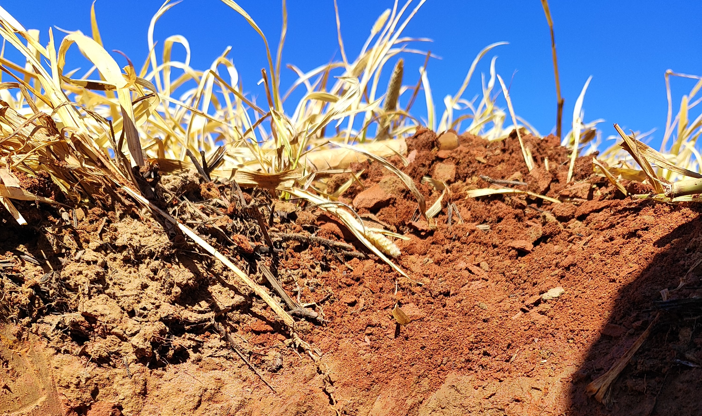
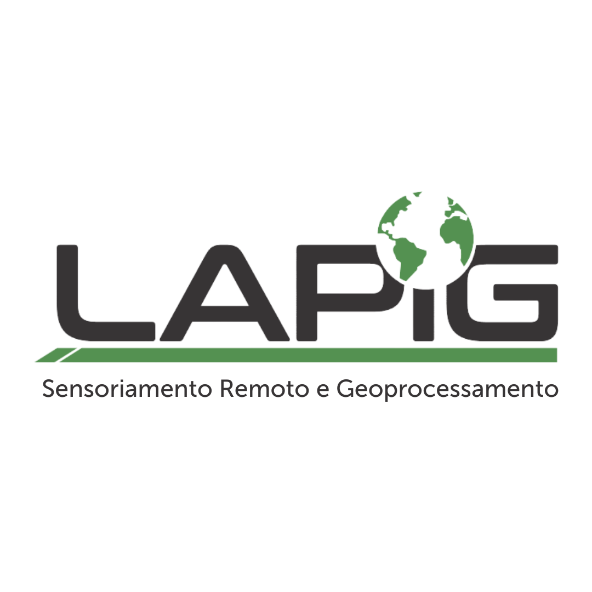
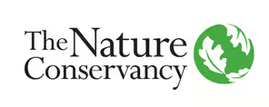
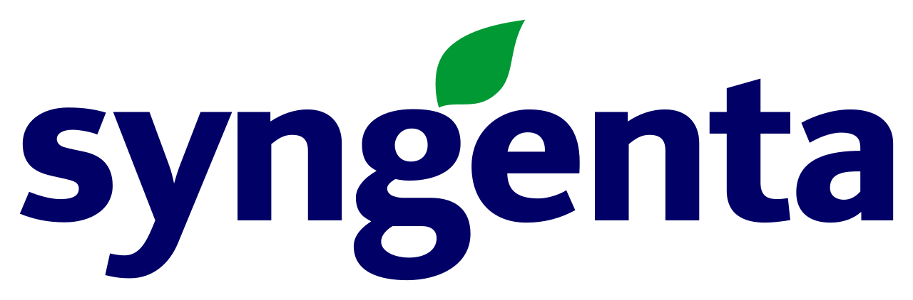

  
   <em>Área de coleta amostral, Goiás, 2025.</em>

# Monitoramento de Carbono - Iniciativa REVERTE®

Bem-vindo à documentação oficial do projeto de **Monitoramento de Carbono**, uma colaboração estratégica entre a **The Nature Conservancy (TNC)**, **Syngenta** e o Laboratório de Sensoriamento Remoto e Geoprocessamento da Universidade Federal de Goiás (**LAPIG/UFG**). 

---

## Objetivo do Projeto
O programa REVERTE® busca apoiar produtores rurais na recuperação de áreas degradadas no Cerrado, promovendo a transição para sistemas de cultivo agrícola mais produtivos e sustentáveis. Este repositório documenta os protocolos científicos e técnicos utilizados para estimar o sequestro de carbono orgânico no solo e os impactos ambientais dessas práticas.

[↗ Saiba mais sobre a Iniciativa REVERTE®](https://www.tnc.org.br/sobre-a-tnc/quem-somos/como-trabalhamos/nossos-apoiadores/apoiadores/syngenta-reverte/)

---

## Guia de Navegação

A documentação está organizada em quatro seções que seguem o fluxo lógico do projeto — do contexto geral até a implementação técnica. Recomenda-se a leitura na ordem apresentada para melhor compreensão.

### [Contexto](mds/contexto.md)
Entenda o panorama da pecuária no Brasil, os desafios do monitoramento de solo e o papel fundamental do programa REVERTE® na mitigação climática.

### [Referências Conceituais](mds/referencias_conceituais.md)
Base científica sobre o **Modelo Century**, processos de calibração para o bioma Cerrado e as variáveis meteorológicas e edáficas consideradas.

### [Requisitos para Modelagem](mds/requisitos_para_modelagem.md)
Detalhamento de como os dados são processados, desde imagens Sentinel-2 via Google Earth Engine até o plano amostral de campo realizado em 2025.

### [Processos (Scripts)](mds/scripts.md)
Acompanhamento técnico dos códigos de automação desenvolvidos em **R** (espacialização), **Google Earth Engine** (extração de dados) e **Python** (validação). Todos os scripts estão disponíveis e linkados em sua respectiva [página de documentação](mds/scripts.md).

---

## Instituições Parceiras

| Logotipo | Instituição |
| :---: | :--- |
|  | **Laboratório de Sensoriamento Remoto e Geoprocessamento (LAPIG/UFG)** |
|  | **The Nature Conservancy (TNC)** |
|  | **Syngenta** |

---
*Dúvidas sobre a documentação? Entre em contato com a equipe técnica do LAPIG/UFG.*

**Coordenador Científico:** [Laerte Ferreira](mailto:laerter@ufg.br)  
**Coordenadora Técnica:** [Maria Hunter](mailto:maria.hunter@ufg.br)  
**Colaboradores:** [Felipe Jesus](mailto:felipejesus@discente.ufg.br), [Marcos Cardoso](mailto:marcoscardoso@discente.ufg.br), Maiara Pedral, Ana Pretto, Isabela Nogueira e Alexandre Siqueira

*
