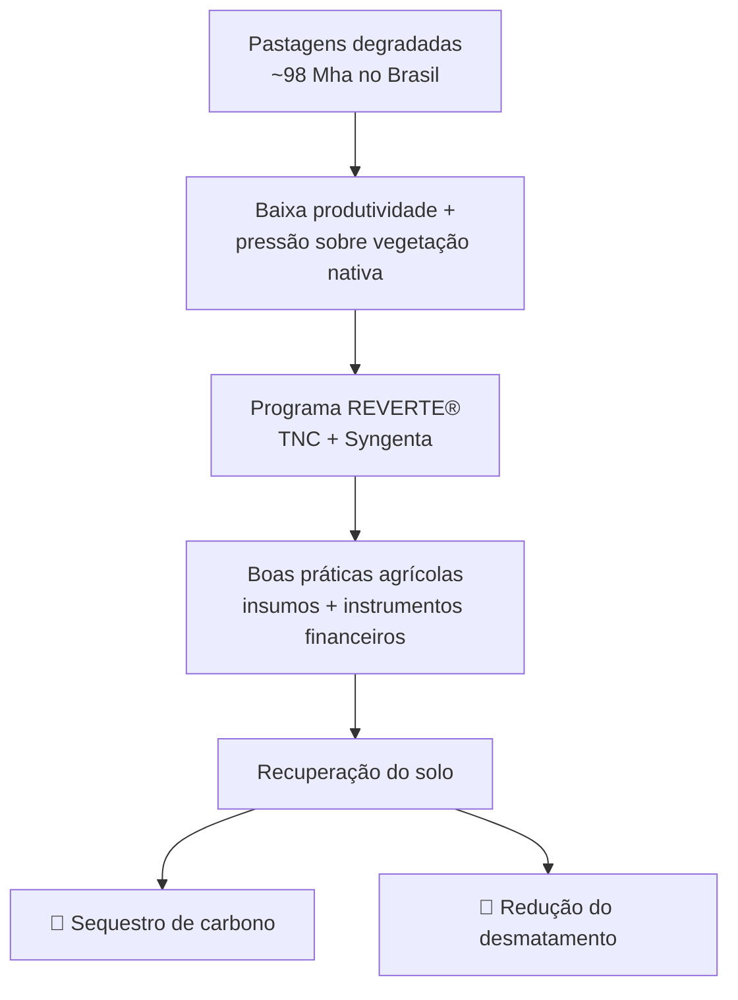
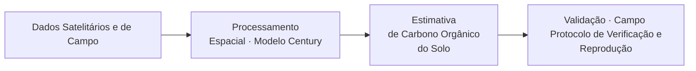

# Contexto

> Esta seção apresenta o cenário que motivou o projeto: o problema da degradação de pastagens no Brasil, a resposta do programa REVERTE® e os desafios científicos do monitoramento de carbono no solo.

---

## Panorama da Pecuária no Brasil

Apesar do Brasil ser o maior exportador de carne do mundo (2.327 toneladas em 2022) (FAO, 2023), suas práticas de pecuária são predominantemente extensivas, caracterizadas pelo baixo uso de tecnologia e baixa produtividade (Oliveira et al., 2018), o que implica em grandes rebanhos distribuídos em vastas áreas de pastagens, ocupando cerca de **21%** do território nacional (Parente et al., 2017).

A prevalência de práticas inadequadas de manejo explica tanto os baixos níveis de produtividade na pecuária quanto a degradação e o abandono de pastagens (Macedo et al., 2013). Resultados recentes obtidos pelo Lapig/UFG indicam que cerca de **98 Mha** de pastagens no Brasil apresentam algum sinal de degradação (Santos et al., 2022), enquanto outros **10 Mha** constituem atualmente áreas abandonadas (Parente et al., 2021).

No entanto, a restauração e o uso mais eficiente dessas vastas áreas de pastagens degradadas podem gerar ganhos ambientais significativos, incluindo a conservação do solo (Arantes et al., 2016), além de maior sequestro de carbono atmosférico (por exemplo, Bustamante et al., 2012). Ademais, o melhor manejo e otimização do uso das áreas de pastagens pode contribuir para a redução do desmatamento, dado que, ao longo dos anos, a expansão do rebanho tem ocorrido principalmente às custas da abertura de novas áreas, especialmente nos biomas Amazônia e Cerrado (Parente e Ferreira, 2018). De fato, as vastas áreas de pastagens no Brasil, particularmente aquelas com sinais de degradação, podem e devem ser consideradas reservas de terras disponíveis para outros usos (por exemplo, Lambin et al., 2013).

---

## O Programa REVERTE®

Dentro desse contexto, a iniciativa REVERTE®, fruto de colaboração entre a The Nature Conservancy (TNC) e a Syngenta, foi lançada em 2019, tendo por objetivo apoiar os produtores rurais na recuperação de áreas em processo de degradação no Cerrado para o cultivo agrícola, reduzindo assim a pressão sobre áreas de vegetação nativa. Esse processo é realizado por meio de uma solução integrada que envolve boas práticas agrícolas, instrumentos financeiros e protocolos de uso de insumos, desde fertilizantes e sementes, até máquinas e defensivos agrícolas. Especificamente, o programa busca contribuir com a evolução e escalada da agricultura regenerativa no Cerrado, preconizando a conservação do solo e da vegetação nativa.

De 2019 até 2021, as duas organizações concluíram as etapas de planejamento colaborativo e desenho dos pilares do projeto, fundamentais para sua fase de expansão. A operacionalização do programa iniciou nos estados de Mato Grosso, Goiás e Maranhão, e hoje está sendo desenvolvida também em outras regiões, buscando expandir sua atuação e implementação de modelo de negócio já testado. No entanto, o apoio da TNC concentra-se no bioma Cerrado, onde existem convergências das estratégias de ambas as organizações.

A implementação em escala do programa REVERTE® no Cerrado brasileiro representa um ganho duplo, tanto para conter o avanço da conversão da vegetação nativa, como ao fomento à implementação de práticas agrícolas para recuperação de solos alinhadas aos princípios da agricultura regenerativa. O desafio em questão é monitorar e reportar os diversos benefícios e impactos que o REVERTE® tem no campo. 

*Figura 1. Surgimento e objetivos do programa REVERTE®.* 

---

## Desafios do Monitoramento de Carbono

Parte relevante dos impactos está relacionada ao ganho ambiental associado à proteção dos remanescentes de vegetação agrícola existentes e ao potencial incremento de carbono no solo decorrente da adoção de melhores práticas da agricultura regenerativa. Entretanto, o dimensionamento desses benefícios apresenta desafios, especialmente em relação ao ganho de carbono orgânico no solo. 

A América do Sul possui diversos ecossistemas e tipos de solo, além de variado relevo, e contém cerca de 10% (**160 Gt C**) do estoque mundial de carbono orgânico do solo. Uma expansão da agricultura regenerativa nas terras agricultáveis da região tem o potencial de armazenar até **0,3 Gt C** anualmente, ou seja, uma estimativa de **2 Gt C** até 2030. Essas estimativas, no entanto, dependem de suposições em escala nacional ou mesmo global e não levam em conta o papel da variabilidade local no armazenamento de carbono no solo. 

Sem uma especificidade mais granular nas estimativas de armazenamento de carbono no solo, é um desafio identificar e priorizar os locais ou tipos de práticas que têm o maior impacto de mitigação climática. Além disso, ainda não se pode prever a contribuição de projetos individuais com a especificidade necessária para gerar compensações de carbono ou benefícios de escopo 3 de acordo com os padrões de registro.

---

## O Papel do LAPIG/UFG

O Laboratório de Sensoriamento Remoto e Geoprocessamento da Universidade Federal de Goiás (LAPIG/UFG), é referência quanto ao monitoramento biofísico-ambiental de paisagens naturais e antrópicas e responsável pela produção dos mapas anuais de pastagem do MapBiomas para todo o país, irá desenvolver e combinar abordagens e metodologias estabelecidas e validadas baseadas em modelagem para testar a capacidade de monitoramento específico de projetos individuais.

*Figura 2. Fluxograma da abordagem metodológica do LAPIG/UFG para o monitoramento de estoques de carbono.*

Para detalhes sobre os dados utilizados e os scripts desenvolvidos, consulte as seções:

- [Requisitos para Modelagem](requisitos_para_modelagem.md)
- [Processamento e Scripts](scripts.md)