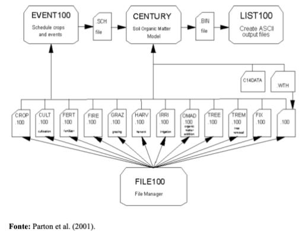
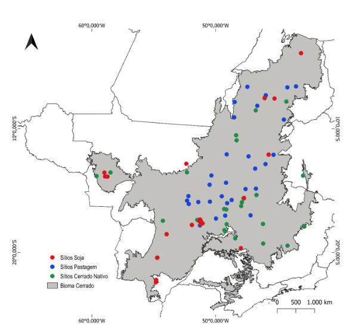
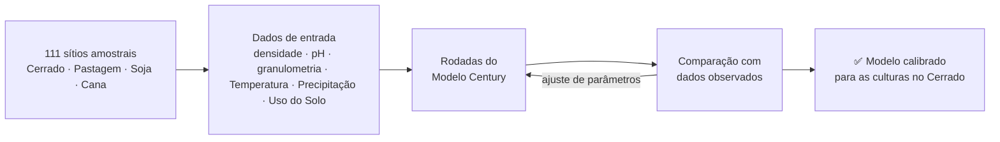
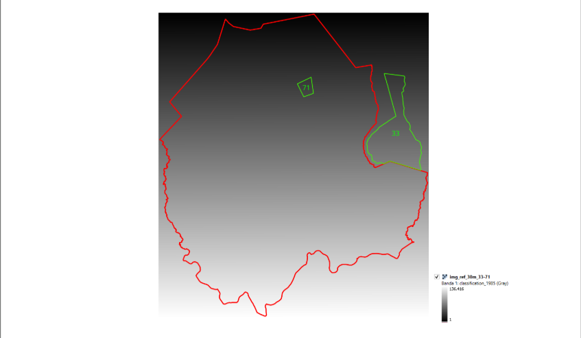
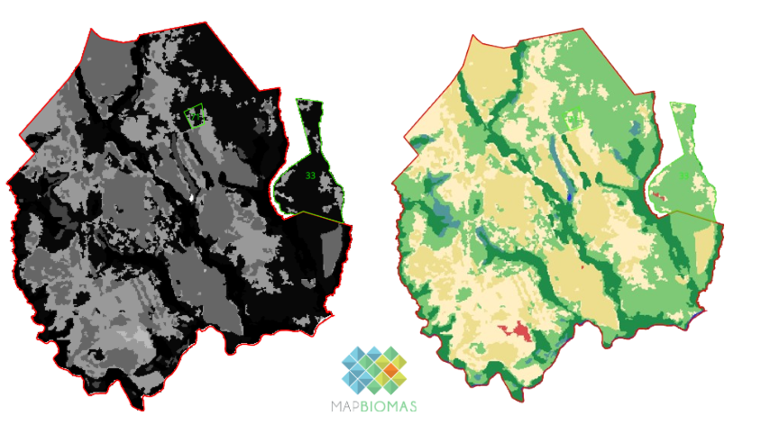
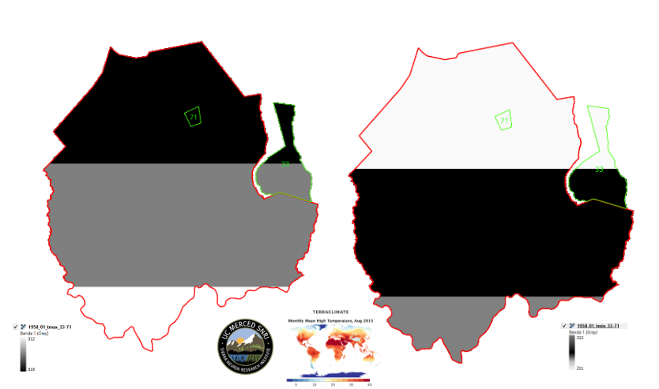
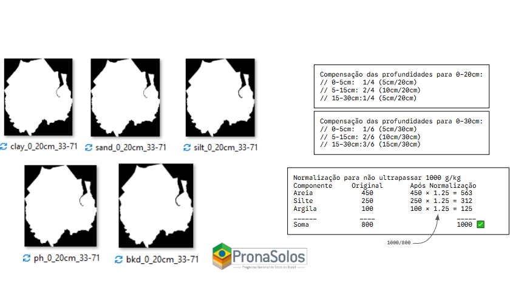
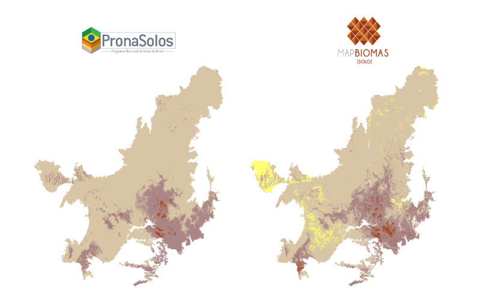

# Referências Conceituais

> Esta seção apresenta a base científica do projeto: o Modelo Century, 
> sua calibração para o Cerrado e as variáveis complementares utilizadas na modelagem.

## O Modelo Century

O modelo Century é um modelo de processos biogeoquímicos utilizado para estimar a ciclagem e estoques de nutrientes críticos em ecossistemas variados. Desenvolvido pelo Colorado State University, tem ampla aplicação no Brasil e em ecossistemas tropicais (Wendling et al., 2014; Baethgen et al., 2021). O modelo permite estimar a ciclagem e estoques de Carbono, Fósforo, Nitrogênio e Enxofre, porém tem maior aplicação para Carbono e Nitrogênio.

O modelo é composto de três sub-modelos: vegetação, água e dinâmica de matéria orgânica e precisa de entradas sobre cobertura e manejo ao longo do tempo, clima e solo. A estrutura básica dos arquivos utilizados para estruturar o modelo está à mostra em Figura 1. Os doze arquivos que fazem parte do FILE100 permitem especificar o uso e cobertura ao longo do tempo.

*Figura 1. Estrutura do modelo Century mostrando a relação entre os programas e os arquivos acessórios detalhando a agenda dos usos e eventos ao longo do tempo (EVENT100) e os detalhes de tratamento de manejo e uso como fertilização (FERT), pastejo (GRAZ), e fogo (FIRE) entre outros.*

## Calibração e Validação no Cerrado Brasileiro

O LAPIG em parceria com UFS e TNC tem trabalhado ao longo dos últimos anos na melhoria do modelo Century na região do Cerrado Brasileiro (Santos et al., 2022, Santos et al., 2024) e na calibração do modelo para usos típicos da região. Atualmente, já possui a calibração e validação a partir de **111 sítios** distribuídos (Figura 2) na região para três usos específicos: Cerrado (**39**), pastagem (**30**) e soja (**42**). 

*Figura 2. Distribuição de 111 sítios utilizada para calibração e validação de modelo CENTURY divididos entre 3 coberturas: cerrado (39), pastagem (30) e soja (42).*

A calibração do modelo requer dados de estoques de carbono, densidade, pH e granulometria do solo, além de informações sobre a vegetação. Atualmente, as amostras exibem variabilidade regional, climática e de tipos de solo. No entanto, o agrupamento dos locais de amostragem resulta em uma cobertura desigual, com algumas regiões apresentando um número reduzido de amostras.

Para otimizar o modelo, a seleção de áreas de amostragem de solo deve considerar a distribuição atual das propriedades rurais que integram o programa REVERTE®, bem como a baixa representatividade espacial nos locais de calibração e validação. A escolha das fazendas para amostragem adicional priorizou aquelas que possibilitam a comparação entre áreas de soja e pastagens, levando em conta fatores como solo, região, dados de manejo disponíveis e o tempo decorrido desde a conversão, conforme o agrupamento das fazendas e suas variáveis específicas.

## Variáveis e Dados Complementares

Além dos dados fornecidos pela Syngenta, foram levantadas as informações que atualmente servem de base para o modelo, considerando as características específicas de cada fazenda participante do programa:

> Imagens figurativas, não representando as fazendas participantes do programa.

### Imagem de Referência

Para cada fazenda, é gerado um raster onde cada pixel recebe um ID sequencial único.

*Figura 3. Área de referência da fazenda utilizada para o levantamento de variáveis.*

### Uso e Cobertura do Solo — MapBiomas Coleção 10

Os dados de uso e cobertura do solo foram obtidos a partir da Coleção 10 do MapBiomas, com resolução espacial de **30 m** e cobertura temporal de **1985 a 2024** (40 anos).

*Figura 4. Dados de Uso e Cobertura do Solo (MapBiomas) para a área da fazenda.*

### Dados Climáticos — TerraClimate

Os dados climáticos mensais foram obtidos do TerraClimate, com cobertura temporal de **1958 a 2024**, resolução espacial original de **4638,3 m**, reamostrada para **30 m**. As variáveis utilizadas são temperatura máxima (tmax), temperatura mínima (tmin) e precipitação (prec). Importante: **não é aplicada a multiplicação de escala (0,1)** nos dados brutos.

*Figura 5. Dados climáticos do TerraClimate aplicados à fazenda.*

### Propriedades do Solo — PronaSolos/Embrapa

As características edáficas foram extraídas do PronaSolos (Embrapa), com resolução espacial original de **90 m**, reamostrada para **30 m**. As variáveis extraídas foram: densidade do solo (bkd), argila (clay), areia (sand), silte (silt) e pH, para as profundidades de **0–20 cm** e **0–30 cm**. As profundidades são compostas por compensação ponderada das camadas originais (0–5 cm, 5–15 cm e 15–30 cm) e a granulometria é normalizada para não ultrapassar 1000 g/kg.

*Figura 6. Características edáficas (PronaSolos/Embrapa) da fazenda.*

---

Posteriormente, os dados de granulometria (argila, areia e silte) do **PronaSolos** foram substituídos pelos dados do **MapBiomas Solo**, que oferecem maior detalhamento espacial para o bioma Cerrado, permitindo a utilização de dados mais proximos ao encontrado em campo, e consequentemente estimativas mais acuradas dos estoques de carbono orgânico no solo. Os dados de pH e densidade do solo foram mantidos do PronaSolos.

*Figura 7. Comparativo dos dados de granulometria (argila, areia e silte) do PronaSolos e MapBiomas Solo.*

---

Para detalhes sobre os dados utilizados e os scripts desenvolvidos, consulte as seções:

- [Requisitos para Modelagem](requisitos_para_modelagem.md)
- [Processos (Scripts)](scripts.md)