# Requisitos para Modelagem

> Esta seção detalha o processamento de dados geoespaciais, o plano amostral 
> de campo e a preparação do modelo Century para as culturas do Cerrado.

---

Para subsidiar as simulações do modelo Century no contexto do projeto REVERTE®, foi realizado um extenso processamento de dados geoespaciais e ambientais. Inicialmente, foi estruturado um banco de dados com informações de uso e cobertura da terra provenientes da Coleção 10 do MapBiomas (Mapbiomas, 2025), abrangendo o período de 1985 a 2024, com resolução espacial de 30 metros. Esses dados foram essenciais para caracterizar o histórico de uso da terra nas fazendas participantes localizadas no bioma Cerrado entre os estados de Goiás, Mato Grosso, Mato Grosso do Sul, Tocantins e Maranhão.

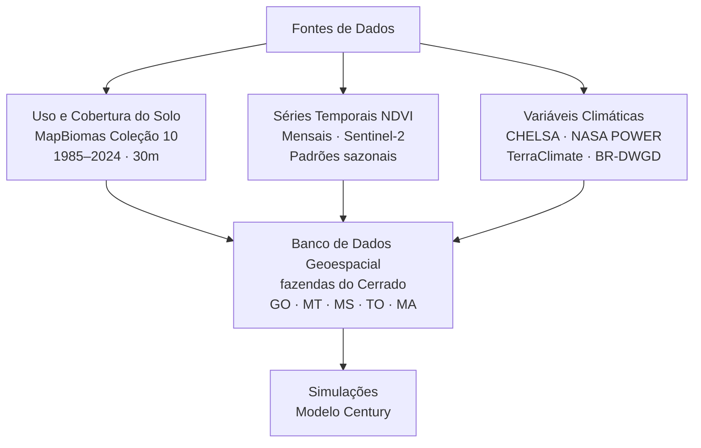
*Figura 1. Fluxograma de processamento de dados geoespaciais e ambientais para subsidiar as simulações do modelo Century no contexto do projeto REVERTE®.*

Complementarmente, foram processadas séries temporais de NDVI mensais, com o objetivo de identificar padrões sazonais de cobertura vegetal e atividades agrícolas ao longo dos anos. Também foram extraídas variáveis climáticas essenciais ao funcionamento do modelo Century, como temperatura (máxima, mínima e média mensal) e precipitação acumulada mensal. Esses dados foram obtidos a partir das bases globais CHELSA (Climatologies at High Resolution for the Earth’s Land Surface Areas), NASA POWER (Prediction Of Worldwide Energy Resources), TerraClimate and WorldClim e a base nacional BR-DWGD (Brazilian Daily Weather Gridded Data).

Com o intuito de verificar a compatibilidade entre as fontes de dados climáticos, foi conduzida uma análise preliminar de consistência entre as séries históricas de todas as bases e comparação com dados de torres meteorológicas (Figura 2). A equipe técnica concluiu que a base de dados TerraClimate se mostrou mais completa, com estimativas de variáveis climáticas mais próximas aos dados das torres. Dessa forma, as variáveis climáticas foram extraídas e organizadas individualmente para cada fazenda.

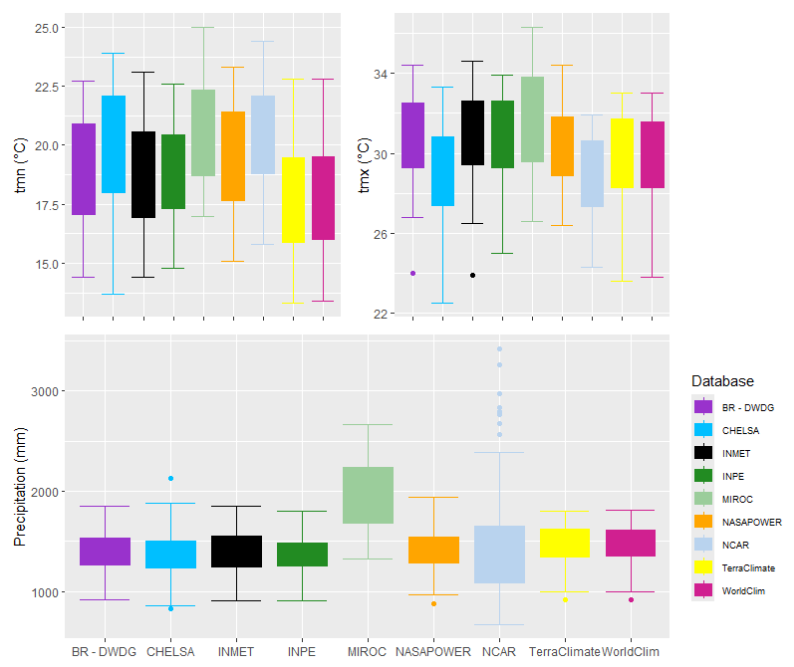
*Figura 2. Temperaturas mínimas (A), máximas médias (B) e precipitação acumulada anual (C) referentes ao período de 1980-2005 observadas em estações meteorológicas (INMET) e disponíveis nas bases de dados.*

Além dos valores de quantidade de chuva e dos valores médios de temperatura, outro fator importante a ser analisado é a distribuição ao longo do ano. É importante que os dados climáticos utilizados como entrada para modelagem dos estoques de C na região reproduzam bem essa variação, uma vez que esse fator é determinante para o crescimento da vegetação, principal via de entrada de carbono no ecossistema.

Para garantir a acurácia na identificação do uso da terra atual e recente, foi elaborada uma rotina específica no **Google Earth Engine** (Figura 3) que realiza a extração de todas as imagens disponíveis do sensor Sentinel-2A para os polígonos dos talhões das fazendas. 
O [script utilizado](../mds/scripts.md#downloads-e-gee) permite a visualização otimizada das imagens em composição colorida real, além da geração automática da série temporal de NDVI para o ponto central de cada talhão. A frequência das imagens (a cada cinco dias) viabilizou a inspeção visual detalhada dos usos agrícolas praticados em cada área, mesmo em cenários com elevada cobertura de nuvens. Além de identificação de cobertura e cultivo sub-anual, permitiu identificar datas estimadas para manejos como revolvimento de solo ou distúrbios como queimas.

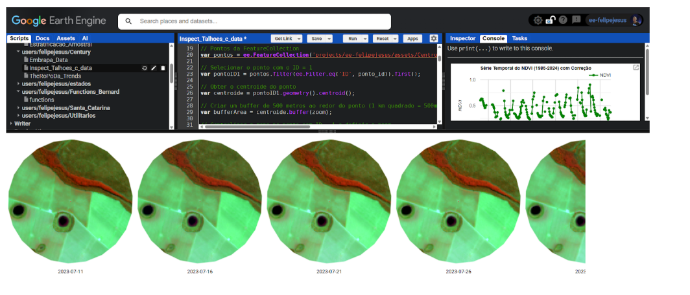
*Figura 3. Código desenvolvido no Google Earth Engine para inspeção visual de talhões e extração de séries temporais de NDVI.*

Para melhorar a variabilidade dos solos considerados, foram comparadas a granulometria dos solos das talhões REVERTE® levantadas nos anos anteriores pela Syngenta com dados de calibração e validação do modelo Century específica de áreas de pastagens e soja. A distância até pontos de calibração e validação e a similaridade entre os solos foram identificadas.

Como resultado dessa etapa, foi gerada uma planilha síntese contendo as principais informações fenológicas e agronômicas observadas: tipo de cultivo, sistema de plantio, data estimada de plantio e colheita, práticas de manejo (como pousio e rotação), e outras variáveis consideradas relevantes para a parametrização do modelo Century:

- Uso sub-anual de ano 2021 - 2024 por meio de inspeção de imagens Sentinel-2 ([Visualizar no GEE](https://code.earthengine.google.com/8b73184a6f2574169c9a6acd9134706b));
- Datas estimadas de queima e revolvimento de solo a partir de 2021;
- Uso anual ano 1985-2024 seguindo a moda da classificação dentro de MapBiomas Coleção 10 ([Visualizar no GEE](https://code.earthengine.google.com/0d3186d3eea31a5f6788e703eb3d1184));
- Ano de abertura a partir de 1985;
- Temperatura mensal histórico e média (CHELSA, NASA POWER e TerraClimate);
- Precipitação acumulada mensal histórico e média (CHELSA, NASA POWER e TerraClimate);
- Propriedades do solo: granulometria, pH, densidade e carbono (Syngenta e complemento EMBRAPA);
- Tendência NDVI calculada via Theropoda — ferramenta desenvolvida pelo LAPIG/UFG ([Repositório GitHub](https://github.com/lapig-ufg/TheroPoDa));
- Região Ecofisiológica (Sano et al., 2019);
- Distância até sítios de atual calibração/validação do Century com usos “pastagem” e “soja”;
- Dissimilaridade entre textura de solo (Syngenta) e sítios de atual calibração/validação do Century com usos “pastagem” e “soja”.

Com base na planilha síntese, foram selecionadas fazendas e talhões específicos para amostragem de carbono no solo no período de entressafra. Após o contato prévio feito pela Syngenta, a equipe entrou em contato com todas as fazendas para obter a data de colheita estimada e confirmar a acessibilidade antes de finalizar o planejamento do campo.

---

## Plano Amostral

O plano amostral na Figura 4 foi utilizado para toda a amostragem realizada em campo. Para cada talhão, foi realizada uma seleção aleatória de três regiões de 1 ha onde seriam coletados amostras indeformadas para estimativas de densidade, e deformados para análise de granulometria, pH e carbono. As amostras indeformadas foram retiradas do ponto central da área amostral com amostrador de impacto em camadas **0 - 5, 5 - 10, 10 - 20, e 20 - 30 cm** e transferidos para sacola para reutilização do anel kopek com volume conhecido. 

Em volta da amostra indeformada, 5 pontos entre uma distância de **3 m** do ponto central foram amostrados com trado sonda para compor uma amostra composta nas profundidades de **0 - 10, 10 - 20, e 20 - 30 cm** (amostra deformada). As amostras foram depositadas em um balde e misturadas. Em seguida, uma porção de 500 g de cada profundidade foi separada e seca ao ar livre para ser transportada ao laboratório.

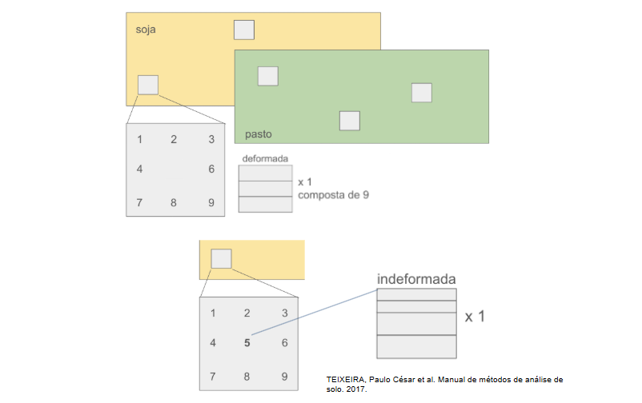{ width="100%" }
*Figura 4. Desenho amostral das coletas das amostras de solo.*

---

## Regiões de Campo

As fazendas selecionadas foram separadas em três regiões, especificando a rota, quilometragem e prioridade.

| Região | Estados | Fazendas | Talhões | Solos |
|:---|:---|:---:|:---:|:---|
| Central | GO, MT | 13 | 28 | Franco-argiloso, arenoso | 
| Matopiba | MA, TO | 4 | 7 | Areia franca, franco-argiloso | 
| Sul | MS | — | — | Franco-arenoso, argilo-arenoso |

*Quadro 1 - Resumo das amostragens de campo realizadas nas diferentes regiões.*

<!-- **Região Central:** Fazendas de Goiás e Mato Grosso constam com o maior número de regiões edafoclimáticas do Cerrado e o maior número de Fazendas e Talhões dentro do programa REVERTE® (Figura 5A). Dos 119 talhões que fazem parte do programa, 79 estão nesta região. Também incluem os usos mais frequentes, sendo soja/pousio, soja/pastagem e soja/milho. Nessa região a equipe completou a amostragem em 13 fazendas e 28 talhões ao longo de 30 dias no mês de Julho 2025. 
A equipe percorreu mais de 5000 km e o projeto contou com um orçamento de aproximadamente R$50.000,00. Os solos do Mato Grosso variam entre franco arenoso e areia franca, e de Goiás entre franco-argiloso, arenoso e argilo-arenoso. Considerando a inexistência de amostragem atual de calibração e validação para a modelagem de soja no estado de Goiás, e a escassez de amostras para pastagens no estado de Mato Grosso, com uma distribuição geográfica limitada às proximidades da fronteira com Goiás, as amostras provenientes das talhões e fazendas REVERTE® irão aprimorar a capacidade de monitoramento da região por meio de modelagem.

**Região Matopiba:** Na região do Matopiba há oito fazendas e 27 talhões do Programa REVERTE® nos estados de Maranhão e Tocantins. Foram selecionadas três fazendas e sete talhões nas ecorregiões de Floresta de Cocais e Araguaia Tocantins para completar a amostragem de solo. Os talhões nessa região mostram usos de pousio e pastagem na safrinha, e variabilidade na granulometria dos solos entre areia franca, franco-argiloso, arenoso e franco-arenoso. Essa região também tem menos precipitação do que a região central com precipitação total anual ~1000 mm. O campo para amostragem desta região aconteceu no mês de Agosto abrangendo 4500 km e orçamento de R$30.000.

**Região Sul:** No estado de Mato Grosso do Sul, tem quatro fazendas e treze talhões que fazem parte do Programa REVERTE®. Nesta região conta com talhões com usos de soja/trigo além do soja/pousio, e soja/pastagem. Tem dois tipos de solos distintos, franco-arenoso e argilo-arenoso. Como a textura dos solos, usos e variáveis edafoclimáticas não são muito diferentes das fazendas e regiões incluídos no plano de amostragem em outros estados, a amostragem dessa região teve prioridade menor. O campo adicional para fazer amostragem nesta região dependerá de recursos adicionais. -->

**Região Central:** Fazendas de Goiás e Mato Grosso concentram o maior número de regiões edafoclimáticas do Cerrado e a maior parte das fazendas e talhões selecionados para amostragem dentro do programa REVERTE®. Os usos mais frequentes nessa região são soja/pousio, soja/pastagem e soja/milho. A amostragem foi realizada ao longo de 30 dias em julho de 2025, percorrendo mais de **5.000 km** com orçamento de aproximadamente **R$50.000,00**. 
Os solos do Mato Grosso variam entre franco-arenoso e areia franca, e os de Goiás entre franco-argiloso, arenoso e argilo-arenoso. As amostras coletadas nessa região irão aprimorar a capacidade de monitoramento por modelagem, especialmente considerando a baixa representatividade atual de sítios de calibração para soja em Goiás e para pastagens no Mato Grosso.

**Região Matopiba:** Abrangendo fazendas nos estados do Maranhão e Tocantins, foram selecionadas propriedades nas ecorregiões de Floresta de Cocais e Araguaia Tocantins para complementar a amostragem de solo. Os talhões dessa região apresentam usos de pousio e pastagem na safrinha, com variabilidade na granulometria entre areia franca, franco-argiloso, arenoso e franco-arenoso. A região recebe menor precipitação em relação à Região Central, com total anual de aproximadamente **1.000 mm**. A amostragem ocorreu em agosto de 2025, abrangendo cerca de **4.500 km** com orçamento de **R$30.000,00**.

**Região Sul:** No estado de Mato Grosso do Sul, foram identificadas fazendas com talhões sob usos de soja/trigo, soja/pousio e soja/pastagem, com dois tipos de solo predominantes: franco-arenoso e argilo-arenoso. Por apresentar características edafoclimáticas semelhantes às das demais regiões já amostradas, essa região recebeu prioridade menor no plano amostral. A realização de coletas adicionais nessa região está condicionada à disponibilidade de recursos.

---

## Coletas em Campo

A coleta na região central foi realizada entre os dias 3 e 28 de Julho de 2025; a amostragem de solo ocorreu em 13 fazendas e 28 talhões. Outras 4 fazendas e 7 talhões integraram a coleta na região do Matopiba no mês de Agosto de 2025. 
No total, 649 amostras foram coletadas (**371 indeformadas e 278 deformadas**) nas 17 fazendas e 35 talhões (Figura 5). Todas os resultados das amostras foram recebidos no final de Janeiro de 2026.

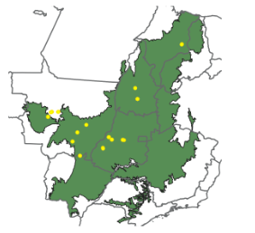{ width="100%" }
*Figura 5. Distribuição das fazendas selecionadas para coleta de amostras de carbono no solo.*

Nas amostras de campo houve grande variabilidade em textura e carbono. O carbono em áreas de pastagem variou entre 20 e 88 T ha⁻¹ considerando 0 - 30 cm de profundidade, e em áreas de cultivo varia entre **19 e 72 T ha⁻¹**.  Onde temos amostras de pasto e cultivo na mesma fazenda, observou-se que a maioria apresentou **maior estoque de carbono nas áreas cultivadas**.

---

## Preparação do Modelo Century

Foi realizada uma revisão da literatura para obtenção de dados de referência de carbono orgânico no solo em áreas com cultivo de cana de açúcar e milho no Cerrado na qual foram encontrados dados de **25 sítios** sob cultivo de cana e **42 sítios** sob cultivo de milho. Os dados de cana de açúcar encontram-se concentrados na região centro-sul que é a região com clima mais propício para esse cultivo (Oliveira et al., 2012) (Figura 6A) enquanto os dados de milho encontram-se mais bem distribuídos pelo bioma (Figura 6B).

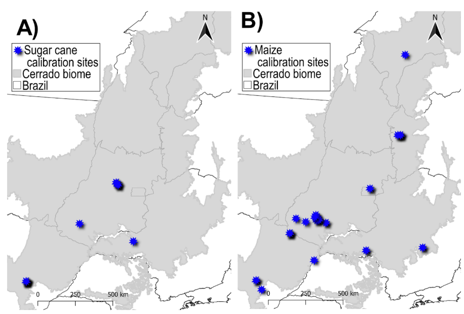
*Figura 6. Mapa da área de estudo (bioma Cerrado), com a localização dos sítios de calibração (0-20 cm) para os cultivos de: A) cana de açúcar e B) milho.*

A revisão bibliográfica para obtenção de dados de carbono na biomassa da cana de açúcar (Figura 7A) e biomassa e grãos do milho (Figura 7B) precisou incluir dados amostrados em outras regiões do Brasil, uma vez que o número de referências encontradas considerando somente o Cerrado foi muito baixa. Para trabalhos que apresentavam apenas dados de matéria seca a conversão para carbono foi realizada considerando o fator de conversão de **50%** (IPCC, 2006).

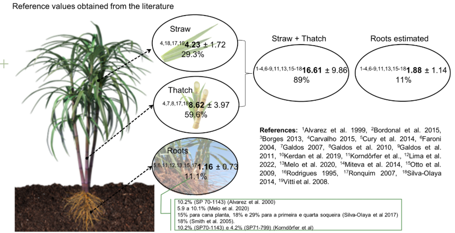
*Figura 7A. Valores de referência de carbono na biomassa aérea e radicular da cana de açúcar no Brasil.*

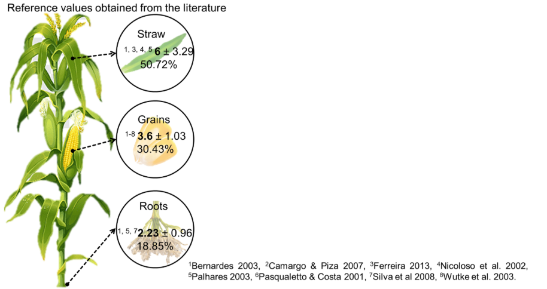
*Figura 7B. Valores de referência de carbono na biomassa aérea, radicular e grão de milho no Brasil.*

Também foi realizada uma revisão dos trabalhos que utilizaram o modelo CENTURY para simular os estoques e a dinâmica de carbono em áreas com ambos os cultivos. Nesta revisão foram encontrados e testados, 4 trabalhos com parâmetros pré-ajustados para simular a cana-de-açúcar (Brandani et al., 2015; Carvalho, 2014; Galdos et al., 2010; Wendling, 2007)  e 5 parâmetros pré-ajustados para o cultivo de milho (Barbosa, 2021; Dias, 2010; Metherell et al., 1993; Rosendo, 2010; Vogado, 2020).

Informações sobre manejo nos dois cultivos, incluindo a prática de queima da cana-de-açúcar até o ano 2007, e adubação também foram levantadas. No preparo do solo para o plantio da cana de açúcar, foram utilizados parâmetros (CULT) do trabalho de Wendling (2007); no plantio, foi simulada a adubação (FERT) com 140 kg/ha de P2O5 (Rein et al., 2022) e 120 kg/ha* de N (valor médio dos trabalhos de Galdos et al., 2010; Franco et al., 2015; Oliveira et al., 2017; Zani et al., 2018).  
Nos sítios com adição de torta de filtro e vinhaça, foram utilizados parâmetros de adição de matéria orgânica (OMAD) do trabalho de Brandani et al., 2015 com alguns ajustes adicionais. A inserção ou não da queima da cana na preparação para colheita foi inserida de acordo com as informações disponibilizadas para cada sítio de forma individual. Para os sítios onde houve queima da palha, foram utilizados os parâmetros de colheita (HARV) do trabalho de Wendling (2007) e para os que não tiveram queima, foram utilizados os parâmetros disponibilizados em Galdos et al., (2010).

No preparo do solo para o plantio do milho, foram utilizados dois conjuntos de parâmetros (CULT): um para plantio direto e outro para sítios sob plantio convencional. Posteriormente, foram simulados dois eventos de adubação (FERT), um no plantio e outro referente a cobertura (30 dias após o plantio). No plantio, simulou-se a adubação com 30 Kg ha de N, 80 kg ha de P2O5 e 20 kg ha de S e na cobertura 100 Kg ha de N.  
No campo, a determinação da necessidade de nutrientes deve ser feita através da análise de solo, no entanto, nem todos os trabalhos utilizados como referência disponibilizam esta informação. A necessidade de criar parâmetros gerais para um cultivo ou região apontou para utilizar valores médios. Os valores médios de N, P e S utilizados nas simulações foram calculados considerando uma produtividade média de 6 a 8 t/ha de grãos, em solos com teor médio de argila e com disponibilidade média desses nutrientes (Alves et al., 2000; Coelho, 2006; Gianluppi et al., 2002; Sousa & Lobato, 2004).

Na Figura 8 é possível observar a representação esquemática dos períodos de cultivos simulados em: A) Cana de açúcar; B) áreas com soja como safra principal e milho na entressafra e C) milho como safra principal.

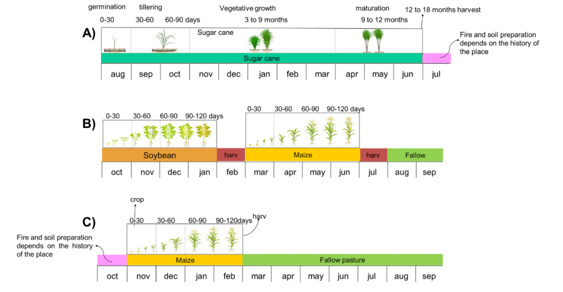
*Figura 8. Representação esquemática dos períodos de cultivos simulados em: A) cana de açúcar; B) áreas com soja como safra principal e milho na entressafra e C) milho como safra principal.*

### Cana-de-Açúcar

Entre os parâmetros encontrados e testados para o cultivo de Cana os que apresentaram resultados mais compatíveis com os dados de referência foram os de Wendling (2007). Entretanto, subestimaram os valores de carbono na biomassa aérea, logo, foi necessária a realização de ajustes adicionais para atingir valores mais próximos aos observados na literatura (Figuras 9A e 9B). Apesar dos resultados próximos aos observados para solo e biomassa aérea, o conjunto de parâmetros atuais superestima os valores de carbono das raízes e novos ajustes estão em andamento para corrigir as superestimativas nesse compartimento.

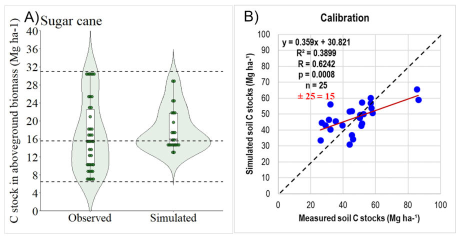
*Figura 9. Comparação entre valores publicados de carbono orgânico (A) na biomassa aérea e (B) no solo (0-20 cm) em áreas de cana-de-açúcar e valores estimados pelo modelo CENTURY 4.5.*

### Milho

Entre os parâmetros encontrados e testados para o cultivo de milho os que apresentaram resultados mais compatíveis com os dados de referência foram os parâmetros default do modelo (Metherell et al., 1993). No entanto, percebeu-se uma subestimativa dos valores de carbono na biomassa acima do solo e grãos e uma superestimativa do carbono nas raízes. Para melhorar as estimativas de carbono nesses compartimentos foram necessários ajustes nos parâmetros relacionados a produção potencial mensal acima do solo - 'PRDX(1)', fração inicial de carbono alocada às raízes - 'FRTC(1)' e índice de colheita máximo (fração de carbono vivo acima do solo no grão) - 'HIMAX'.

Os parâmetros ajustados diferem para sítios com milho simulado como safra principal e segunda safra. Isso porque geralmente há diferença entre as variedades de milho usadas na safra principal e na safrinha para a qual costuma-se escolher híbridos de ciclo mais curto, com rápido desenvolvimento inicial, e maior tolerância ao estresse hídrico. Já na safra principal há maior disponibilidade hídrica e período de crescimento, permitindo uso de ciclos mais longos e voltados a um maior potencial produtivo (Borghi et al., 2023). Na figura 10 é possível observar a relação entre os estoques de carbono do solo mensurados e simulados pelo modelo para os sítios com milho na safra principal (Figura 10A) e na segunda safra (Figura 10B).

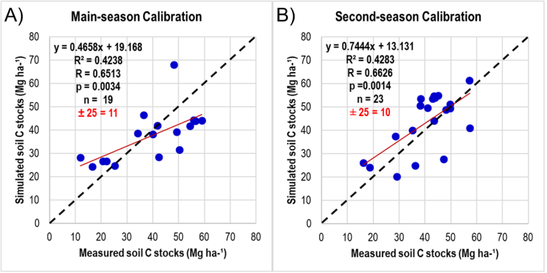
*Figura 10. Calibração de milho safra (A) e safrinha (B) para estoques de carbono orgânico no solo para o profundidade de 0-20 cm.*

---
- [← Referências Conceituais](referencias_conceituais.md)
- [Processamento e Scripts](scripts.md)