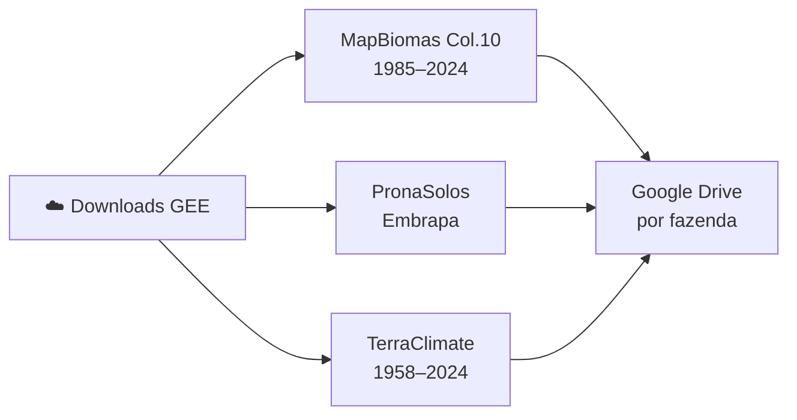
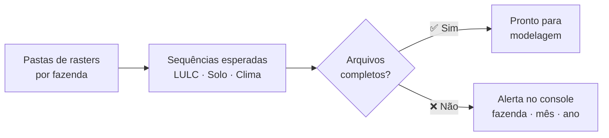

# Processamento e Scripts

> Esta seção detalha em módulos os conjuntos de scripts desenvolvidos para o processamento de dados, modelagem do Century e automação.


*Figura 1. Visão geral da arquitetura de processos e automação.*

---

## Downloads das bases ambientais pelo Google Earth Engine

Estão na pasta `Outros_Scripts` (Arquivos que começam com `GEE`):


*Figura 2. Extração de variáveis ambientais via Google Earth Engine.*

- [**GEE - Download Lulc Mapbiomas.txt**](../base_dados/aplicacao/Scripts/Outros_Scripts/GEE%20-%20Download%20Lulc%20Mapbiomas.txt): Script para download de mapas de uso e cobertura do solo do MapBiomas.
    <br>**Principais Etapas:**
    1. Carrega os limites (rasters mascarados) das fazendas.
    2. Importa a base do MapBiomas Coleção 9.
    3. Itera sobre os anos históricos (1985–2023) e fazendas.
    4. Recorta e exporta os dados anuais de uso da terra com resolução de 30m para o Google Drive.
    ??? abstract "Ver Código-Fonte"
        ```javascript
        # LAPIG - Grupo Carbono
        #
        # 2025-05-30
        # Marcos Cardoso; Maria Hunter
        #
        # https://code.earthengine.google.com/efb8e74e730ee20c263d93766a7e32b1?noload=true
        #
        # --
        
        var fazendas_rasters = ee.ImageCollection('coloque aqui sua image collection');
        var mapbiomas_col9 = ee.Image('projects/mapbiomas-public/assets/brazil/lulc/collection9/mapbiomas_collection90_integration_v1');
        
        var idsDasFazendas = fazendas_rasters.aggregate_array('system:index').getInfo();
        var anos = ee.List.sequence(1985, 2023);
        
        idsDasFazendas.forEach(function(id) {
          var fazendaImage = fazendas_rasters.filter(ee.Filter.eq('system:index', id)).first();
        
          if (fazendaImage) {
            var geometry = fazendaImage.geometry();
            var mascaraFazenda = fazendaImage.gt(0);
        
            anos.getInfo().forEach(function(ano) {
              var banda_lulc_anual = 'classification_' + ano;
              var lulc_anual_selecionado = mapbiomas_col9.select(banda_lulc_anual);
              var lulcRecortadoBruto = lulc_anual_selecionado.clip(geometry);
              var lulcMascarado = lulcRecortadoBruto.updateMask(mascaraFazenda);
              var description_name = ano + '_lulc_' + id;
        
              Export.image.toDrive({
                image: lulcMascarado.rename(banda_lulc_anual),
                description: description_name,
                folder: 'LULC_Serie_Temporal',
                scale: 30,
                region: geometry.bounds(),
                maxPixels: 1e13
              });
            });
          } else {
            print('Aviso: Imagem da fazenda com ID ' + id + ' não encontrada.');
          }
        });
        ```
- [**GEE - Download Soil Embrapa.txt**](../base_dados/aplicacao/Scripts/Outros_Scripts/GEE%20-%20Download%20Soil%20Embrapa.txt): Script para extração de dados de propriedades do solo da base PronaSolos (Embrapa).
    <br>**Principais Etapas:**
    1. Importa os rasters do PronaSolos (Areia, Silte, Argila, pH, Densidade) para as camadas originais (0-5, 5-15, 15-30cm).
    2. Realiza o cálculo de média ponderada para criar uma variável consolidada para a camada de 0 a 30 cm.
    3. Reamostra a resolução espacial (reduceResolution) para 30 metros para compatibilidade com o projeto.
    4. Itera sobre cada fazenda, recorta e mascara os polígonos.
    5. Exporta os resultados estruturados para o Google Drive.
    ??? abstract "Ver Código-Fonte"
        ```javascript
        # LAPIG - Grupo Carbono
        #
        # 2025-05-30
        # Marcos Cardoso; Maria Hunter
        #
        # https://code.earthengine.google.com/4ec9305e8eaa5f84447e72cb504d7fda?noload=true
        #
        # --
        
        
        var embrapaSand = ee.Image('projects/mapbiomas-workspace/SOLOS/REFERENCIAS/EMBRAPA/embrapa_pronassolos_sand');
        var embrapaSilt = ee.Image('projects/mapbiomas-workspace/SOLOS/REFERENCIAS/EMBRAPA/embrapa_pronassolos_silt');
        var embrapaClay = ee.Image('projects/mapbiomas-workspace/SOLOS/REFERENCIAS/EMBRAPA/embrapa_pronassolos_clay');
        
        var bkd_0_5cm = ee.Image('projects/lapig-459118/assets/embrapa_pronassolos/br_bulk_density_0-5cm_pred_Mg_m3');
        var bkd_5_15cm = ee.Image('projects/lapig-459118/assets/embrapa_pronassolos/br_bulk_density_5-15cm_pred_Mg_m3');
        var bkd_15_30cm = ee.Image('projects/lapig-459118/assets/embrapa_pronassolos/br_bulk_density_15-30cm_pred_Mg_m3');
        
        var ph_0_5cm = ee.Image('projects/lapig-459118/assets/embrapa_pronassolos/br_ph_h2o_0-5cm');
        var ph_5_15cm = ee.Image('projects/lapig-459118/assets/embrapa_pronassolos/br_ph_h2o_5-15cm');
        var ph_15_30cm = ee.Image('projects/lapig-459118/assets/embrapa_pronassolos/br_ph_h2o_15-30cm');
        
        
        var fazendas_rasters = ee.ImageCollection('');
        
        var processarSolo = function(band0_5, band5_15, band15_30, outputBandName) {
          var ponderado = band0_5.multiply(1/6)
                           .add(band5_15.multiply(2/6))
                           .add(band15_30.multiply(3/6));
        
          ponderado = ponderado.rename(outputBandName);
        
          var resampled = ponderado.reduceResolution({
            reducer: ee.Reducer.mean(),
            maxPixels: 65500
          }).reproject({
            crs: 'EPSG:4326',
            scale: 30
          });
        
          return resampled;
        };
        
        var areiaProcessada = processarSolo(
          embrapaSand.select('sand_content_0_5cm_pred_g_kg'),
          embrapaSand.select('sand_content_5_15cm_pred_g_kg'),
          embrapaSand.select('sand_content_15_30cm_pred_g_kg'),
          'sand_0-30'
        );
        
        var siltProcessado = processarSolo(
          embrapaSilt.select('silt_content_0_5cm_pred_g_kg'),
          embrapaSilt.select('silt_content_5_15cm_pred_g_kg'),
          embrapaSilt.select('silt_content_15_30cm_pred_g_kg'),
          'silt_0-30'
        );
        
        var clayProcessado = processarSolo(
          embrapaClay.select('clay_content_0_5cm_pred_g_kg'),
          embrapaClay.select('clay_content_5_15cm_pred_g_kg'),
          embrapaClay.select('clay_content_15_30cm_pred_g_kg'),
          'clay_0-30'
        );
        
        var bkdProcessado = processarSolo(bkd_0_5cm, bkd_5_15cm, bkd_15_30cm, 'bkd_0-30');
        var phProcessado = processarSolo(ph_0_5cm, ph_5_15cm, ph_15_30cm, 'ph_0-30');
        
        
        var idsDasFazendas = fazendas_rasters.aggregate_array('system:index').getInfo();
        
        idsDasFazendas.forEach(function(id) {
          var fazendaImage = fazendas_rasters.filter(ee.Filter.eq('system:index', id)).first();
        
          if (fazendaImage) {
            var geometry = fazendaImage.geometry();
            var mascaraFazenda = fazendaImage.gt(0);
        
            var areiaRecortadaBruto = areiaProcessada.clip(geometry);
            var areiaMascarada = areiaRecortadaBruto.updateMask(mascaraFazenda);
            Export.image.toDrive({
              image: areiaMascarada.round().int16(),
              description: 'sand_0_30cm_' + id,
              folder: 'embrapa',
              scale: 30,
              region: geometry.bounds(),
              maxPixels: 1e13
            });
        
            var siltRecortadoBruto = siltProcessado.clip(geometry);
            var siltMascarado = siltRecortadoBruto.updateMask(mascaraFazenda);
            Export.image.toDrive({
              image: siltMascarado.round().int16(),
              description: 'silt_0_30cm_' + id,
              folder: 'embrapa',
              scale: 30,
              region: geometry.bounds(),
              maxPixels: 1e13
            });
        
            var clayRecortadoBruto = clayProcessado.clip(geometry);
            var clayMascarado = clayRecortadoBruto.updateMask(mascaraFazenda);
            Export.image.toDrive({
              image: clayMascarado.round().int16(),
              description: 'clay_0_30cm_' + id,
              folder: 'embrapa',
              scale: 30,
              region: geometry.bounds(),
              maxPixels: 1e13
            });
        
            var bkdRecortadoBruto = bkdProcessado.clip(geometry);
            var bkdMascarado = bkdRecortadoBruto.updateMask(mascaraFazenda);
            Export.image.toDrive({
              image: bkdMascarado.round().int16(),
              description: 'bkd_0_30cm_' + id,
              folder: 'embrapa',
              scale: 30,
              region: geometry.bounds(),
              maxPixels: 1e13
            });
        
            var phRecortadoBruto = phProcessado.clip(geometry);
            var phMascarado = phRecortadoBruto.updateMask(mascaraFazenda);
            Export.image.toDrive({
              image: phMascarado.round().int16(),
              description: 'ph_0_30cm_' + id,
              folder: 'embrapa',
              scale: 30,
              region: geometry.bounds(),
              maxPixels: 1e13
            });
          }
        });
        ```
- [**GEE - Download Terraclimate.txt**](../base_dados/aplicacao/Scripts/Outros_Scripts/GEE%20-%20Download%20Terraclimate.txt): Script para aquisição de séries temporais de variáveis climáticas (TerraClimate).
    <br>**Principais Etapas:**
    1. Define os anos de interesse e filtra a coleção TerraClimate anual.
    2. Processa cada variável climática (ex: temperatura mínima `tmmn`), agrupando a média mensal de todos os dias do mês.
    3. Altera a resolução espacial global (reescalona de ~4km para 30m).
    4. Itera sobre cada fazenda, recorta as coleções processadas pela geometria do limite.
    5. Exporta os GeoTIFFs mês a mês para o Google Drive com o prefixo apropriado.
    ??? abstract "Ver Código-Fonte"
        ```javascript
        # LAPIG - Grupo Carbono
        #
        # 2025-05-30
        # Marcos Cardoso; Maria Hunter
        #
        # 
        # https://code.earthengine.google.com/3f9fad4e13fa80d7d5ceafbb883e8bea?noload=true
        #
        #
        # --
        
        var fazendas = ee.FeatureCollection('');
        var idsUnicos = fazendas.aggregate_array('id').distinct().getInfo();
        print('IDs:', idsUnicos);
        print('Número):', idsUnicos.length);
        
        var anosParaProcessar = [];
        for (var i = 1958; i <= 1958; i++) {
          anosParaProcessar.push(i);
        }
        
        function agruparFazendasPorId(id) {
          return fazendas.filter(ee.Filter.eq('id', id));
        }
        
        anosParaProcessar.forEach(function(ano) {
          print('Processando ano:', ano);
        
          var startDate = ee.Date.fromYMD(ano, 1, 1);
          var endDate = ee.Date.fromYMD(ano, 12, 31);
        
          var datasetAnual = ee.ImageCollection('IDAHO_EPSCOR/TERRACLIMATE')
                              .filter(ee.Filter.date(startDate, endDate));
        
          function processarMesParaAno(mes) {
            mes = ee.Number(mes);
            var colecaoMensal = datasetAnual
                                .filter(ee.Filter.calendarRange(mes, mes, 'month'))
                                .select('tmmn');
            var baseImage = ee.Image(colecaoMensal.first());
        
            var mensal = colecaoMensal.mean()
                                .round()
                                // .multiply(0.1)
                                .setDefaultProjection(baseImage.projection());
        
            var resampled = mensal.reduceResolution({
              reducer: ee.Reducer.mean(),
              maxPixels: 65536
            }).reproject({
              crs: 'EPSG:4326',
              scale: 30
            });
        
            return resampled;
          }
        
          var meses = ee.List.sequence(1, 12);
          var imagensMensaisAnuais = meses.map(processarMesParaAno);
        
          function exportarPorGrupoParaAno(idFazenda) {
            var grupoFazendas = agruparFazendasPorId(idFazenda);
            var primeiraFazenda = ee.Feature(grupoFazendas.first());
            var nomeFazendaInfo = primeiraFazenda.get('nome').getInfo();
        
            var nomeFazenda;
            if (!nomeFazendaInfo) {
              nomeFazenda = idFazenda;
            } else {
              nomeFazenda = String(nomeFazendaInfo).replace(/[^a-zA-Z0-9_]/g, '-').toLowerCase();
            }
        
            var geometriaAgrupada = grupoFazendas.geometry().dissolve();
        
            for (var i = 0; i < 12; i++) {
              var mesNumero = i + 1;
              var imagemMensal = ee.Image(imagensMensaisAnuais.get(i));
              var recorte = imagemMensal.clip(geometriaAgrupada).round();
              var mesFormatado = ('0' + mesNumero).slice(-2);
        
              var nomeArquivo = ano + '_' + mesFormatado + '_tmin_' + nomeFazenda;
              var pastaDrive =  nomeFazenda;
              var descricaoTask = 's_' + ano + '_' + mesFormatado + '_' + nomeFazenda;
        
              Export.image.toDrive({
                image: recorte.int16(),
                description: descricaoTask,
                folder: pastaDrive,
                fileNamePrefix: nomeArquivo,
                region: geometriaAgrupada,
                scale: 30,
                maxPixels: 1e9,
                fileFormat: 'GeoTIFF',
                formatOptions: {
                  cloudOptimized: true
                }
              });
            }
          }
        
          idsUnicos.forEach(exportarPorGrupoParaAno);
        });
        
        print('Geração de tarefas de exportação iniciada para os anos:', anosParaProcessar);
        ```
---

## Processamento de preparação de Imagens no Rstudio

Estão na pasta `Outros_Scripts` (Arquivos que começam com `R`):


*Figura 3. Fluxo de manipulação espacial e preparação de imagens no R.*

- [**R - Criar imagem referencia.R**](../base_dados/aplicacao/Scripts/Outros_Scripts/R%20-%20Criar%20imagem%20referencia.R): Geração de imagem raster de referência contendo IDs únicos por pixel para a área de estudo.
    <br>**Principais Etapas:**
    1. Define o diretório contendo os rasters originais.
    2. Importa cada raster utilizando o pacote `terra`.
    3. Atribui a cada pixel uma sequência numérica unívoca (de 1 até o número total de células).
    4. Exporta as novas imagens com o prefixo `img_ref_30m_`.
    ??? abstract "Ver Código-Fonte"
        ```R
        # LAPIG - Grupo Carbono
        #
        # 2025-05-30
        # Marcos Cardoso; Maria Hunter
        #
        # --
        
        
        library(terra)
        
        input_folder <- "C:/Users/marco/Downloads/ID-RASTER"
        output_folder <- "C:/Users/marco/Downloads/img_ref"
        
        if (!dir.exists(output_folder)) {
          dir.create(output_folder, showWarnings = FALSE, recursive = TRUE)
          print(paste("Pasta de saída criada:", output_folder))
        }
        
        tiff_files <- list.files(path = input_folder, pattern = "\\.tif$", full.names = TRUE, ignore.case = TRUE)
        
        if (length(tiff_files) == 0) {
          stop(paste("Nenhum arquivo .tif foi encontrado na pasta de entrada:", input_folder))
        } else {
          print(paste("Encontrados", length(tiff_files), "arquivos .tif para processar da pasta:", input_folder))
        }
        
        for (file_path in tiff_files) {
          tryCatch({
            original_file_name_with_ext <- basename(file_path)
            original_file_name_no_ext <- tools::file_path_sans_ext(original_file_name_with_ext)
        
            output_file_name <- paste0("img_ref_30m_", original_file_name_no_ext, ".tif")
            output_file_path <- file.path(output_folder, output_file_name)
        
            print(paste("Processando:", original_file_name_with_ext))
        
            r_original <- rast(file_path)
            id_raster <- r_original
            id_raster[] <- 1:ncell(id_raster)
        
            writeRaster(id_raster, output_file_path, overwrite = TRUE)
        
            print(paste("Salvo em:", output_file_path))
        
          }, error = function(e) {
            print(paste("Erro ao processar o arquivo", basename(file_path), ":", e$message))
          })
        }
        
        print(paste("Processamento concluído! Arquivos salvos em:", output_folder))
        ```
- [**R - Criar imagem referencia individual.R**](../base_dados/aplicacao/Scripts/Outros_Scripts/R%20-%20Criar%20imagem%20referencia%20individual.R): Geração de rasters de referência específicos para fazendas ou áreas individuais.
    <br>**Principais Etapas:**
    1. Importa um arquivo `.tif` alvo individual.
    2. Aplica a mesma lógica do script anterior, substituindo todos os valores por um ID sequencial `1:ncell`.
    3. Salva a nova imagem diretamente na mesma pasta de origem.
    ??? abstract "Ver Código-Fonte"
        ```R
        # LAPIG - Laboratório de Processamento de Imagens e Geoprocessamento
        # Script: Criar Raster de Referência (ID)
        #
        # Data: 2024-06-23
        #
        # Descrição:
        # Este script carrega um arquivo raster .tif específico, cria um novo
        # raster onde cada pixel tem um valor de ID sequencial único, e salva
        # este novo raster na mesma pasta do arquivo original com um nome modificado.
        # --
        
        # Carrega a biblioteca 'terra' para manipulação de dados raster.
        # Se não estiver instalada, instale com: install.packages("terra")
        library(terra)
        
        input_file_path <- "D:/Projetos-Lapig/century/revert/rasters/Fazendas/MT - Agua Cristal - 6-57-7/lulc_mb_col9_30m/1985_lulc_6-57-7.tif"
        
        tryCatch({
        
          if (!file.exists(input_file_path)) {
            stop("O arquivo de entrada não foi encontrado. Verifique o caminho.")
          }
        
          input_folder <- dirname(input_file_path)
          original_file_name_with_ext <- basename(input_file_path)
          original_file_name_no_ext <- tools::file_path_sans_ext(original_file_name_with_ext)
        
          output_file_name <- paste0("img_ref_30m_", original_file_name_no_ext, ".tif")
          output_file_path <- file.path(input_folder, output_file_name)
        
          print(paste("Processando:", original_file_name_with_ext))
        
          r_original <- rast(input_file_path)
        
          id_raster <- r_original
        
          id_raster[] <- 1:ncell(id_raster)
        
          writeRaster(id_raster, output_file_path, overwrite = TRUE)
        
          print(paste("Arquivo de referência salvo com sucesso em:", output_file_path))
        
        }, error = function(e) {
          print(paste("ERRO ao processar o arquivo:", basename(input_file_path)))
          print(paste("Mensagem de erro:", e$message))
        })
        ```
- [**R - Recortar img referencia com base nos talhoes.R**](../base_dados/aplicacao/Scripts/Outros_Scripts/R%20-%20Recortar%20img%20referencia%20com%20base%20nos%20talhoes.R): Recorte das imagens de referência utilizando os limites vetoriais dos talhões de interesse.
    <br>**Principais Etapas:**
    1. Importa a imagem de referência base (raster) e os polígonos dos talhões (shapefile).
    2. Alinha o sistema de coordenadas (CRS) do vetor com o do raster.
    3. Para cada polígono individual, executa o corte geométrico (`crop`) e aplica a máscara para manter apenas a área exata do talhão.
    4. Salva a camada recortada correspondente a cada ID de talhão.
    ??? abstract "Ver Código-Fonte"
        ```R
        # LAPIG - Laboratório de Processamento de Imagens e Geoprocessamento
        # Grupo Carbono 
        # Script: Criar Raster de Referência (ID)
        #
        # Data: 2024-06-23
        # Marcos Cardoso, Felipe Jesus, Maria Hunter
        # 
        # Descrição:
        # Recorta as imagens referência com base nos shapefiles dos talhões
        # --
        
        library(raster)
        library(sf)
        
        caminho_raster <- "D:/Projetos-Lapig/century/revert/rasters/Fazendas/GO - Morasha - 35-38-76-34-36-39/img_ref_30m_35-38-76-34-36-39.tif"
        caminho_shapefile <- "D:/Projeto_LAPIG/Revert/Centroids Morasha/talhoes_morasha_revert_2.shp"
        diretorio_saida <- "D:/Projeto_LAPIG/Revert/Centroids Morasha/Talhoes_Recortados"
        
        if (!dir.exists(diretorio_saida)) {
          dir.create(diretorio_saida, recursive = TRUE)
        }
        
        imagem_base <- raster(caminho_raster)
        talhoes <- st_read(caminho_shapefile)
        
        if (st_crs(talhoes) != crs(imagem_base)) {
          talhoes <- st_transform(talhoes, crs = crs(imagem_base))
        }
        
        for (i in 1:nrow(talhoes)) {
        
          talhao_individual <- talhoes[i, ]
        
          id_talhao <- talhao_individual$layer
        
          raster_recortado <- mask(crop(imagem_base, talhao_individual), talhao_individual)
        
          nome_arquivo_saida <- file.path(diretorio_saida, paste0("img_ref_talhao_", id_talhao, ".tif"))
        
          writeRaster(raster_recortado, filename = nome_arquivo_saida, format = "GTiff", overwrite = TRUE)
        
        }
        ```
- [**R - Recortar raster com base em outro.R**](../base_dados/aplicacao/Scripts/Outros_Scripts/R%20-%20Recortar%20raster%20com%20base%20em%20outro.R): Padronização e alinhamento de extensões espaciais entre diferentes camadas rasters.
    <br>**Principais Etapas:**
    1. Define um raster principal de referência (como o uso do solo).
    2. Cria uma máscara lógica na qual as áreas válidas são aquelas diferentes de `NA` ou `0`.
    3. Para cada imagem alvo (ex: clima/precipitação), executa o reamostramento (resample) usando o método `bilinear` para alinhar os pixels.
    4. Aplica a máscara e preenche com zero as áreas sem dados (`ifel(mask_valida, r_chuva_ajustado, 0)`).
    5. Exporta os resultados alinhados.
    ??? abstract "Ver Código-Fonte"
        ```R
        library(terra)
        
        # --- 1. CONFIGURAÇÃO ---
        caminho_referencia <- "D:/Projetos-Lapig/century/reverte/rasters/fazendas/MT - AGM/lulc_mb_col10_30m/1985_lulc_AGM.tif"
        pasta_precipitacao <- "C:/Users/marco/Downloads/acm_series_completa/acm_series_completa"
        pasta_saida <- file.path(pasta_precipitacao, "recortados_zeros_v2")
        
        if (!dir.exists(pasta_saida)) dir.create(pasta_saida)
        
        # --- 2. PREPARAÇÃO DA MÁSCARA (OTIMIZAÇÃO) ---
        cat("Carregando referência e criando máscara lógica...\n")
        r_ref <- rast(caminho_referencia)
        
        # Define a condição de validade baseada APENAS no LULC:
        # O pixel é válido se: NÃO for NA "E" for diferente de 0
        mask_valida <- !is.na(r_ref) & (r_ref != 0)
        
        # Carrega lista de arquivos
        arquivos_prec <- list.files(pasta_precipitacao, pattern = "\\.tif$", full.names = TRUE)
        
        # --- 3. PROCESSAMENTO ---
        for (arquivo in arquivos_prec) {
        
          nome_arquivo <- basename(arquivo)
          cat(paste("Processando:", nome_arquivo, "...\n"))
        
          r_chuva <- rast(arquivo)
        
          # 1. Alinha a chuva com a grade do LULC (Geometria 30m)
          r_chuva_ajustado <- resample(r_chuva, r_ref, method = "bilinear")
        
          # 2. Aplica a Lógica Condicional:
          # Onde a mask_valida for TRUE, usa a chuva. Onde for FALSE, usa 0.
          r_final <- ifel(mask_valida, r_chuva_ajustado, 0)
        
          # 3. Limpeza final:
          # A função acima garante 0 onde o LULC não tem info.
          # Mas se a CHUVA for NA dentro da área válida, isso garante que vire 0 também (opcional, mas seguro).
          r_final <- classify(r_final, cbind(NA, 0))
        
          # --- 4. SALVAR ---
          caminho_salvar <- file.path(pasta_saida, nome_arquivo)
          writeRaster(r_final, caminho_salvar, overwrite = TRUE, gdal=c("COMPRESS=LZW"))
        }
        
        cat("--- Processamento concluído! ---\n")
        ```
---

## Modelagem do Century para o ponto amostral

Estão na pasta `Scripts_Ponto`:


*Figura 4. Execução do modelo Century e cálculo de métricas para o ponto amostral.*

A estrutura de pastas recomendada para a **Simulação por ponto** é:

```text
📦 Diretório do Projeto
├── 📂 century/              # Arquivos base e executáveis do modelo Century
├── 📂 century_parametros/   # Planilhas CSV com a lista de parametrizações e alterações
├── 📂 ponto/                # Arquivos de agendamento (.sch e .100) específicos do ponto
├── 📂 reference_values/     # Dados observados em campo/laboratório para calibração
├── 📂 resul/                # Pasta de saída (arquivos .lis, .bin, planilhas e gráficos gerados)
└── 📄 Projeto_R.Rproj       # Projeto R configurado para interligar scripts e diretórios
```

- [**1_rodar_simulações_CR_CM.R**](../base_dados/aplicacao/Scripts/Scripts_Ponto/1_rodar_simulações_CR_CM.R): Executa as simulações do modelo Century para os pontos de calibração e validação.
    <br>**Principais Etapas:**
    1. Lê os agendamentos (`.sch` e `.100`) para a inicialização e o uso do solo.
    2. Importa o arquivo CSV com a lista de parametrizações para rodar cenários múltiplos.
    3. Itera sobre cada simulação, inserindo as alterações no arquivo de parâmetros base.
    4. Identifica automaticamente a existência de arquivos de Clima Real (`.wth`). Se não houver, roda o Clima Médio.
    5. Dispara as funções de console (`runCentury`) para execução e agrupa os resultados.
    ??? abstract "Ver Código-Fonte"
        ```R
        # ----
        # RODAR SIMULAÇÕES CENTURY
        # 
        # O script irá identificar automaticamente se será clima médio ou clima real (.wth)
        # ----
        source("functionsRcentury.R")
        
        schEq <- Sys.glob(file.path("ponto", "E*.sch"))
        cemEq <- Sys.glob(file.path("ponto", "E*.100"))
        schLu <- Sys.glob(file.path("ponto", "Lu*.sch"))
        cemLu <- Sys.glob(file.path("ponto", "Lu*.100"))
        
        lisEq <- gsub("100", "lis", gsub("ponto/", "result/result_lu_cm/", cemEq))
        binEq <- gsub("100", "bin", gsub("ponto/", "result/result_lu_cm/", cemEq))
        lisLu <- gsub("100", "lis", gsub("ponto/", "result/result_lu_cm/", cemLu))
        binLu <- gsub("100", "bin", gsub("ponto/", "result/result_lu_cm/", cemLu))
        
        file100 <- Sys.glob(file.path("century", "*.100"))
        
        dir_csvs <- "century_parametros"
        lista_arquivos_csv <- list.files(
          path = dir_csvs, 
          pattern = "simulation_multfiles_(\\d+|test)\\.csv", 
          full.names = TRUE
        )
        
        total_arquivos <- length(lista_arquivos_csv)
        
        if(total_arquivos == 0) {
          stop("Nenhum arquivo 'simulation_multfiles' (numérico ou test) encontrado no diretório.")
        }
        
        start_time <- Sys.time()
        
        for (idx_arquivo in 1:total_arquivos) {
        
          csv_path <- lista_arquivos_csv[idx_arquivo]
          arquivos_restantes <- total_arquivos - idx_arquivo
          nome_arquivo <- basename(csv_path)
          id_lote <- gsub("simulation_multfiles_|.csv", "", nome_arquivo)
        
          cat("\n#####################################################\n")
          cat(sprintf("ARQUIVO ATUAL: %d de %d | %s (ID Lote: %s)\n", idx_arquivo, total_arquivos, nome_arquivo, id_lote))
          cat(sprintf("FALTAM PROCESSAR: %d arquivo(s)\n", arquivos_restantes))
        
          if (idx_arquivo > 1) {
            elapsed_time <- as.numeric(difftime(Sys.time(), start_time, units = "secs"))
            avg_time <- elapsed_time / (idx_arquivo - 1)
            eta_secs <- avg_time * (arquivos_restantes + 1)
            eta_formatted <- sprintf("%02d:%02d:%02d", eta_secs %/% 3600, (eta_secs %% 3600) %/% 60, round(eta_secs %% 60))
            cat(sprintf("TEMPO ESTIMADO RESTANTE: %s\n", eta_formatted))
          } else {
            cat("TEMPO ESTIMADO RESTANTE: Calculando após o primeiro arquivo...\n")
          }
          cat("#####################################################\n")
        
          toSimulation <- read.csv(csv_path)
          simulations <- unique(toSimulation$simulation)
        
          for (p in 1:length(simulations)){
            cat("  -> Simulation", p, "do Lote", id_lote, "\n")
            toSimulationI <- toSimulation[toSimulation$simulation == p, ]
        
            for(l in 1:nrow(toSimulationI)){
              f100ToChange <- grep(as.character(unique(toSimulationI$arquivo[l])), file100, value = TRUE)
              f100Change <- as.character(toSimulationI[l, 1])
              linhaI <- toSimulationI[l, "linha"]
        
              changFILES_linhaI(changeFrom = f100ToChange , changeTo = f100Change, linha = linhaI)
            }
        
            for (i in 1:length(lisEq)){
              schEqI <- schEq[i]
              cemEqI <- cemEq[i]
              schLuI <- schLu[i]
              cemLuI <- cemLu[i]
        
              # Constroi o caminho esperado para o arquivo .wth correspondente a esta amostra
              wthLuI <- gsub("\\.sch$", ".wth", schLuI)
        
              # Verifica se o arquivo .wth existe no diretório
              if (file.exists(wthLuI)) {
                cat("     [+] Arquivo .wth encontrado. Rodando runCenturyLuCR (Clima Real) para", basename(schLuI), "\n")
                runCenturyLuCR(schEqI, cemEqI, schLuI, cemLuI, wthLuI)
              } else {
                cat("     [-] Arquivo .wth não encontrado. Rodando runCenturyLuCM (Clima Médio) para", basename(schLuI), "\n")
                runCenturyLuCM(schEqI, cemEqI, schLuI, cemLuI)
              }
            }
        
            dir_lote <- paste0("result/result_lu_cm/lote_", id_lote)
            if(!dir.exists(dir_lote)){
              dir.create(dir_lote, recursive = TRUE)
            }
        
            dir_final <- paste0(dir_lote, "/simulation", p)
            if(!dir.exists(dir_final)){
              dir.create(dir_final)
            }
        
            file.copy(from = c(Sys.glob("result/result_lu_cm/*.lis")), to = dir_final, overwrite = TRUE)
            file.copy(from = c(Sys.glob("result/result_lu_cm/*.bin")), to = dir_final, overwrite = TRUE)
        
            file.remove(Sys.glob("result/result_lu_cm/*.bin"),
                        Sys.glob("result/result_lu_cm/*.lis"))
          }
        }
        
        tempo_total <- as.numeric(difftime(Sys.time(), start_time, units = "secs"))
        tempo_total_fmt <- sprintf("%02d:%02d:%02d", tempo_total %/% 3600, (tempo_total %% 3600) %/% 60, round(tempo_total %% 60))
        cat(sprintf("\nTodas as simulações concluídas! Tempo total de execução: %s\n", tempo_total_fmt))
        ```
- [**2_gerar_csv.R**](../base_dados/aplicacao/Scripts/Scripts_Ponto/2_gerar_csv.R): Converte os resultados binários das simulações do Century em planilhas CSV para análise.
    <br>**Principais Etapas:**
    1. Varre as pastas e subpastas das simulações organizadas em Lotes.
    2. Cruza as informações com o arquivo `resumo_variacoes.csv` se existir.
    3. Para cada saída `.lis` gerada pelo Century, lê os dados numéricos tabelados.
    4. Filtra e extrai os anos de interesse da modelagem (ex: 2015-2025).
    5. Consolida todas as extrações de todas as simulações em um arquivo `resultados_century_simulations.csv`.
    ??? abstract "Ver Código-Fonte"
        ```R
        ##################################################################
        #' Claudinei Oliveira dos Santos
        #' Biologo | Msc. Ecologia | Dr. Ciências Ambientais
        #' LAPIG - UFG
        #' claudineisan@pastoepixel.com
        ##################################################################
        
        #' Leitura e Processamento de Arquivos Century (.lis)
        #' Versão: Escolha de anos, Fallback para Eq_, Fallback sem CSV (com texto padrão) e Avisos de Anos
        
        options(scipen = 9999)
        library(tidyverse)
        library(stringr)
        
        ###
        #' Parâmetros Iniciais (Anos de interesse para os arquivos Lu_)
        ano_inicio_lu <- 2015
        ano_fim_lu <- 2025
        
        ###
        #' Caminhos
        path_base_root <- "."
        path_results   <- file.path(path_base_root, "result/result_lu_cm")
        
        # Caminho do arquivo de resumo
        ## -- 
        
        # NÃO É OBRIGATÓRIO ATUALIZAR, APENAS SE QUISER INFORMAR QUAIS PARAMETROS FORAM ALTERADOS (UTILIZE O SCRIPT "XX" PARA GERAR O ARQUIVO) 
        path_resumo_csv <- "0_30/resumo_variacoes.csv" 
        
        ## -- 
        
        ###
        #' 1. Carregar Tabela de Resumo (Lote, Simulation, Obs)
        has_resumo <- FALSE
        
        if (file.exists(path_resumo_csv)) {
          df_resumo <- read.csv(path_resumo_csv, stringsAsFactors = FALSE) 
          names(df_resumo) <- tolower(names(df_resumo)) 
        
          if("lote" %in% names(df_resumo)) df_resumo$lote <- as.numeric(df_resumo$lote)
          if("simulation" %in% names(df_resumo)) df_resumo$simulation <- as.numeric(df_resumo$simulation)
        
          has_resumo <- TRUE
          print("Arquivo de resumo carregado com sucesso.")
        } else {
          message("Aviso: Arquivo resumo_variacoes.csv não encontrado. Os metadados 'lote_folder' e 'sim_folder' serão extraídos das pastas e a coluna 'obs' será preenchida com o texto padrão.")
        }
        
        ###
        #' Listar pastas de Lotes
        dirs_lotes <- list.dirs(path_results, full.names = TRUE, recursive = FALSE)
        dirs_lotes <- grep("lote_", dirs_lotes, value = TRUE)
        
        df_results_final <- NULL
        
        # --- Loop pelos Lotes ---
        for (dir_lote_i in dirs_lotes) {
        
          nome_lote <- basename(dir_lote_i)
          num_lote  <- as.numeric(str_extract(nome_lote, "\\d+"))
        
          print(paste("Processando:", nome_lote))
        
          # --- Loop pelas Simulações ---
          dirs_sims <- list.dirs(dir_lote_i, full.names = TRUE, recursive = FALSE)
          dirs_sims <- grep("simulation", dirs_sims, value = TRUE)
        
          for (dir_sim_j in dirs_sims) {
        
            nome_sim <- basename(dir_sim_j)
            num_sim  <- as.numeric(str_extract(nome_sim, "\\d+"))
        
            # --- LÓGICA DA OBS (Texto Padrão) ---
            obs_text <- "parametros alterados no multfiles"
        
            if (has_resumo) {
              row_match <- df_resumo %>% 
                filter(lote == num_lote & simulation == num_sim)
        
              # Se encontrar correspondência no CSV e o campo não estiver vazio, substitui o texto padrão
              if (nrow(row_match) > 0 && !is.na(row_match$obs[1]) && row_match$obs[1] != "") {
                obs_text <- row_match$obs[1] 
              }
            }
        
            # --- Lógica Lu_ vs Eq_ ---
            lis_files_lu <- Sys.glob(file.path(dir_sim_j, "Lu*.lis"))
            lis_files_eq <- Sys.glob(file.path(dir_sim_j, "Eq*.lis"))
        
            if (length(lis_files_lu) > 0) {
              lis_files <- lis_files_lu
              ano_inicio_filtro <- ano_inicio_lu
              ano_fim_filtro <- ano_fim_lu
              tipo_arquivo_str <- "Lu"
            } else if (length(lis_files_eq) > 0) {
              lis_files <- lis_files_eq
              ano_inicio_filtro <- 9990
              ano_fim_filtro <- 10000
              tipo_arquivo_str <- "Eq"
            } else {
              next 
            }
        
            lis_files_names <- basename(lis_files)
            lis_files_id <- str_remove(str_remove(lis_files_names, "^(Lu_|Eq_)"), "\\.lis$")
        
            nloop <- length(lis_files_id)
        
            for (i in 1:nloop) {
              id_i <- lis_files_id[i]
              file_path <- lis_files[i]
        
              try({
                df_results_i <- read.table(file_path, header = TRUE)
        
                # Identifica os anos presentes no arquivo para caso de erro
                min_ano_disp <- min(df_results_i$time, na.rm = TRUE)
                max_ano_disp <- max(df_results_i$time, na.rm = TRUE)
        
                # Filtro de ano dinâmico
                sub_df_lis_i <- df_results_i[between(df_results_i$time, ano_inicio_filtro, ano_fim_filtro), ]
        
                if (nrow(sub_df_lis_i) > 0) {
                  sub_df_lis_i$ponto        <- str_replace(id_i, '/', '_')
                  sub_df_lis_i$lote_folder  <- nome_lote
                  sub_df_lis_i$sim_folder   <- nome_sim
                  sub_df_lis_i$sim_id       <- num_sim
                  sub_df_lis_i$obs          <- obs_text
                  sub_df_lis_i$tipo_arquivo <- tipo_arquivo_str 
        
                  cols_meta <- c("lote_folder", "sim_folder", "ponto", "tipo_arquivo", "obs", "time")
                  cols_data <- setdiff(names(sub_df_lis_i), cols_meta)
        
                  cols_existentes <- intersect(c(cols_meta, cols_data), names(sub_df_lis_i))
                  sub_df_lis_i <- sub_df_lis_i[, cols_existentes]
        
                  df_results_final <- rbind(df_results_final, sub_df_lis_i)
                } else {
                  # Se não encontrou os anos, emite o alerta no console
                  alerta <- sprintf("-> AVISO: Ponto %s (%s/%s | %s) não contém os anos %d a %d. Anos disponíveis: %d a %d", 
                                    id_i, nome_lote, nome_sim, tipo_arquivo_str, 
                                    ano_inicio_filtro, ano_fim_filtro, 
                                    min_ano_disp, max_ano_disp)
                  message(alerta)
                }
              }, silent = TRUE)
            }
          }
        }
        
        ###
        #' Output
        if (!is.null(df_results_final)) {
          write.csv(df_results_final, 
                    file = file.path(path_base_root, 'result/resultados_century_simulations.csv'), 
                    row.names = FALSE)
          print("Processamento concluído com sucesso.")
        } else {
          print("Nenhum dado válido encontrado para processamento.")
        }
        ```
- [**3_gerar_graficos_avaliacao.R**](../base_dados/aplicacao/Scripts/Scripts_Ponto/3_gerar_graficos_avaliacao.R): Cria gráficos e calcula métricas de erro (observado vs. simulado) para avaliar a calibração do modelo.
    <br>**Principais Etapas:**
    1. Importa as informações observadas (dados de campo/laboratório).
    2. Calcula os erros estatísticos, como o `RMSE`, para comparar o simulado vs. observado.
    3. Elabora um ranking identificando as "Top 10" melhores parametrizações com menor erro.
    4. Plota os gráficos de dispersão `1:1`, as análises de outliers, e a dinâmica temporal das frações (ativo, lento, passivo).
    5. Exporta todos os gráficos renderizados como imagens de alta resolução em pastas específicas.
    ??? abstract "Ver Código-Fonte"
        ```R
        options(scipen = 9999)
        
        library(tidyverse)
        library(stringr)
        library(ggplot2)
        library(ggrepel)
        
        # =========================================================================
        # --- 0. CONFIGURAÇÕES GERAIS ---
        # =========================================================================
        
        
        
        # Defina aqui o uso para carregar os arquivos automaticamente (ex: "reverte", "pastagem_literatura", "soja_literatura" e "vegetacao_literatura")
        dados_observados <- "pastagem_literatura"
        
        # Defina aqui os pontos que deseja ignorar em TODA a análise.
        # Para parar de ignorar, basta comentar a linha abaixo com '#' ou deixá-la vazia: c()
        pontos_ignorar <- c("CDORC021")
        
        # Defina aqui uma variação ESPECÍFICA para forçar a geração de todos os gráficos apenas para ela.
        #combinacao_especifica <- lote_1_sim_1
        combinacao_especifica <- NULL #Sem restrição
        
        # Defina aqui o ano padrão para os dados observados caso o CSV não possua a coluna de Amostragem/Ano
        ano_generico_observado <- 2017
        
        # Defina aqui o prefixo dos gráficos (ex: "VALIDAÇÃO", "CALIBRAÇÃO", "AVALIAÇÃO").
        #prefixo_titulo <- "AVALIAÇÃO"
        
        if(!exists("prefixo_titulo") || is.null(prefixo_titulo) || prefixo_titulo == "") {
          prefixo_titulo <- ""
        }
        
        # =========================================================================
        # --- 1. LEITURA E LIMPEZA AVANÇADA ---
        # =========================================================================
        
        result_century <- read_csv('result/resultados_century_simulations.csv', show_col_types = FALSE)
        
        # Cria o ID único baseado nas pastas para diferenciar as simulações corretamente
        result_century <- result_century %>%
          mutate(sim_id = paste(lote_folder, sim_folder, sep = "_"))
        
        arquivo_obs <- paste0("reference_values/somsc_", dados_observados, "_observado.csv")
        
        # 1.1 Tenta ler com ponto-e-vírgula (;). Se der só 1 coluna, lê com vírgula (,)
        df_observado <- read_delim(arquivo_obs, delim = ";", col_names = FALSE, show_col_types = FALSE)
        if(ncol(df_observado) == 1) {
          df_observado <- read_csv(arquivo_obs, col_names = FALSE, show_col_types = FALSE)
        }
        
        # 1.2 Nomeia as colunas de acordo com o que foi encontrado
        if(ncol(df_observado) >= 3) {
          names(df_observado)[1:3] <- c("ponto_id", "valor_string", "Amostragem")
        } else if(ncol(df_observado) >= 2) {
          names(df_observado)[1:2] <- c("ponto_id", "valor_string")
          df_observado <- df_observado %>% mutate(Amostragem = ano_generico_observado)
          cat("\nAVISO: Coluna de Amostragem ausente. Assumindo o ano de", ano_generico_observado, "para todos os pontos.\n")
        } else {
          stop("ERRO FATAL: O arquivo CSV tem apenas 1 coluna! Verifique como o arquivo foi salvo no Excel.")
        }
        
        # 1.3 Limpeza pesada (Remove cabeçalhos acidentais, espaços, letras e converte)
        df_observado <- df_observado %>%
          filter(!str_detect(tolower(ponto_id), "ponto|id")) %>%
          mutate(
            valor_limpo = str_remove_all(as.character(valor_string), "[^0-9.,]"),
            valor_limpo = str_replace(valor_limpo, ",", "."),
            valor_obs = as.numeric(valor_limpo),
            Amostragem = suppressWarnings(as.numeric(Amostragem)),
            Amostragem = replace_na(Amostragem, ano_generico_observado)
          )
        
        na_gerados <- df_observado %>% filter(is.na(valor_obs))
        if(nrow(na_gerados) > 0) {
          cat("\n[!] ALERTA: As seguintes linhas não tinham números válidos e foram ignoradas:\n")
          print(na_gerados)
        }
        
        df_observado <- df_observado %>% filter(!is.na(valor_obs))
        
        cat("\n>>> TOTAL DE PONTOS DE CAMPO CARREGADOS COM SUCESSO:", nrow(df_observado), "<<<\n")
        
        if(exists("pontos_ignorar") && length(pontos_ignorar) > 0) {
          result_century <- result_century %>% filter(!ponto %in% pontos_ignorar)
          df_observado <- df_observado %>% filter(!ponto_id %in% pontos_ignorar)
          cat("\nAVISO: Os seguintes pontos foram IGNORADOS na análise:", paste(pontos_ignorar, collapse = ", "), "\n")
        }
        
        
        # =========================================================================
        # --- 2. PREPARAÇÃO E CRUZAMENTO ---
        # =========================================================================
        
        df_final <- result_century %>%
          mutate(ano = round(time, 0)) %>%
          inner_join(df_observado, by = c("ponto" = "ponto_id", "ano" = "Amostragem")) %>%
          group_by(ponto, lote_folder, sim_folder, sim_id, obs, valor_obs, ano) %>%
          summarise(somsc = mean(somsc, na.rm = TRUE), .groups = 'drop') %>%
          mutate(somsc = somsc / 100)
        
        
        # =========================================================================
        # --- 3. CÁLCULO ESTATÍSTICO GERAL COM NSE ---
        # =========================================================================
        
        metricas <- df_final %>%
          group_by(lote_folder, sim_folder, sim_id, obs) %>%
          summarise(
            n = n(),
            r2 = if(sum(!is.na(somsc) & !is.na(valor_obs)) > 1) {
              round(cor(somsc, valor_obs, use = "complete.obs")^2, 4)
            } else { NA_real_ },
            nse = if(sum(!is.na(somsc) & !is.na(valor_obs)) > 1 && var(valor_obs, na.rm=TRUE) != 0) {
              round(1 - (sum((somsc - valor_obs)^2, na.rm = TRUE) / sum((valor_obs - mean(valor_obs, na.rm = TRUE))^2, na.rm = TRUE)), 4)
            } else { NA_real_ },
            M = round(mean(somsc - valor_obs, na.rm = TRUE), 4),
            dentro_25pct = sum(somsc >= (valor_obs * 0.75) & somsc <= (valor_obs * 1.25)),
            pct_acerto = round((dentro_25pct / n) * 100, 2),
            rmse = round(sqrt(mean((somsc - valor_obs)^2, na.rm = TRUE)), 4),
            .groups = 'drop'
          )
        
        # =========================================================================
        # --- 4. RANKING TOP 10 COMBINAÇÕES (OU SELEÇÃO ESPECÍFICA) ---
        # =========================================================================
        
        norm_01 <- function(x, invert = FALSE) {
          min_x <- min(x, na.rm = TRUE)
          max_x <- max(x, na.rm = TRUE)
          if(max_x == min_x) return(rep(0.5, length(x))) 
          res <- (x - min_x) / (max_x - min_x)
          if(invert) return(1 - res) else return(res)
        }
        
        metricas <- metricas %>%
          mutate(
            score_rmse = norm_01(rmse, invert = TRUE),
            score_nse = norm_01(nse, invert = FALSE),
            score_acerto = norm_01(pct_acerto, invert = FALSE),
            score_final = round(score_rmse + score_nse + score_acerto, 4)
          )
        
        # LÓGICA DE SELEÇÃO INSERIDA AQUI (AGORA BASEADA NO SIM_ID)
        if (!is.null(combinacao_especifica) && combinacao_especifica != "") {
          cat("\n========================================================")
          cat("\n>>> MODO DE SELEÇÃO ATIVADO: Gerando gráficos apenas para:")
          cat("\n", combinacao_especifica)
          cat("\n========================================================\n")
        
          top_10_combinacoes <- metricas %>% filter(sim_id == combinacao_especifica)
        
          if(nrow(top_10_combinacoes) == 0) {
            stop("ERRO: A combinação especificada não foi encontrada nos dados. Verifique a grafia exata.")
          }
        } else {
          top_10_combinacoes <- metricas %>%
            arrange(desc(score_final)) %>%
            slice_head(n = 10)
        
          print("========================================================")
          print("TOP 10 MELHORES SIMULAÇÕES (Rankeado por Score)")
          print("========================================================")
        }
        
        tabela_print <- top_10_combinacoes %>% 
          select(Simulacao = sim_id, Obs = obs, Score = score_final, R2 = r2, NSE = nse, RMSE = rmse, Acerto_pct = pct_acerto)
        
        # --- NOVO TRECHO DE PRINT NO CONSOLE ---
        if (!is.null(combinacao_especifica) && combinacao_especifica != "") {
          cat("\n======================================================================================\n")
          cat("🎯 MÉTRICAS GERAIS DA SIMULAÇÃO ESPECÍFICA (", combinacao_especifica, ")\n")
          cat("======================================================================================\n")
          print(as.data.frame(tabela_print), row.names = FALSE)
          cat("======================================================================================\n\n")
        } else {
          print(as.data.frame(tabela_print), row.names = FALSE)
        }
        # ---------------------------------------
        
        if(!dir.exists("result")) dir.create("result")
        # Só sobrescreve o ranking geral se não estiver no modo específico
        if (is.null(combinacao_especifica) || combinacao_especifica == "") {
          write.csv(top_10_combinacoes, "result/ranking_top10_simulacoes.csv", row.names = FALSE)
        }
        
        # =========================================================================
        # --- 5. GRÁFICOS 1:1 ---
        # =========================================================================
        
        print("Gerando gráficos 1:1...")
        if(!dir.exists("result/graficos_1_1")) dir.create("result/graficos_1_1", recursive = TRUE)
        
        for(i in 1:nrow(top_10_combinacoes)) {
        
          var_atual <- top_10_combinacoes[i, ]
          nome_sim <- var_atual$sim_id
          rank_num <- ifelse(!is.null(combinacao_especifica) && combinacao_especifica != "", "Alvo Específico", paste("Rank", i))
        
          # Condicional para omitir o texto padrão do mutfiles do subtitulo
          texto_obs_sub <- ifelse(!is.na(var_atual$obs) & var_atual$obs != "parametros alterados no multfiles", paste0(" | Obs: ", var_atual$obs), "")
          subtitulo_plot <- paste0("Simulação: ", nome_sim, texto_obs_sub, " | Score: ", round(var_atual$score_final, 2))
        
          dados_plot <- df_final %>% filter(sim_id == nome_sim)
        
          modelo_lm <- lm(somsc ~ valor_obs, data = dados_plot)
          sumario <- summary(modelo_lm)
        
          intercepto <- format(round(coef(modelo_lm)[1], 4), nsmall=4)
          inclinacao <- format(round(coef(modelo_lm)[2], 4), nsmall=4)
        
          r2_val <- format(round(sumario$r.squared, 4), nsmall=4)
          nse_val <- format(round(var_atual$nse, 4), nsmall=4) 
          p_val  <- format.pval(coef(sumario)[2, 4], digits = 4, eps = 0.0001)
          n_val  <- nrow(dados_plot)
        
          dentro_25 <- sum(dados_plot$somsc >= (dados_plot$valor_obs * 0.75) & 
                             dados_plot$somsc <= (dados_plot$valor_obs * 1.25))
        
          max_val <- max(c(dados_plot$valor_obs, dados_plot$somsc), na.rm = TRUE) * 1.1 
          min_val <- 0 
        
          texto_stats <- paste0(
            "y = ", inclinacao, "x + ", intercepto, "\n",
            "R² = ", r2_val, "\n",
            "NSE = ", nse_val, "\n",
            "p = ", p_val, "\n",
            "n = ", n_val
          )
        
          texto_vermelho <- paste0("± 25% = ", dentro_25)
        
          g <- ggplot(dados_plot, aes(x = valor_obs, y = somsc)) +
            geom_abline(intercept = 0, slope = 1, linetype = "dashed", color = "black", linewidth = 0.8) +
            geom_smooth(method = "lm", se = FALSE, color = "red", linewidth = 0.8) +
            geom_point(color = "blue", size = 3, alpha = 0.8) +
            annotate("text", x = min_val + (max_val * 0.05), y = max_val * 0.95, 
                     label = texto_stats, hjust = 0, vjust = 1, size = 3.5) +
            annotate("text", x = min_val + (max_val * 0.05), y = max_val * 0.60, 
                     label = texto_vermelho, hjust = 0, vjust = 1, 
                     fontface = "bold", color = "red", size = 3.5) +
            labs(
              title = paste0(prefixo_titulo, ": ", rank_num),
              subtitle = subtitulo_plot,
              x = expression(bold("Mensurado (Mg C ha"^-1*")")),
              y = expression(bold("Simulado (Mg C ha"^-1*")"))
            ) +
            scale_x_continuous(limits = c(min_val, max_val)) +
            scale_y_continuous(limits = c(min_val, max_val)) +
            coord_fixed(ratio = 1) + 
            theme_bw() +
            theme(
              plot.title = element_text(hjust = 0.5, face = "bold", size = 12),
              plot.subtitle = element_text(hjust = 0.5, size = 10),
              axis.title = element_text(size = 10),
              panel.grid.minor = element_blank()
            )
        
          nome_limpo <- gsub("[^A-Za-z0-9]", "_", nome_sim) 
          ggsave(filename = paste0("result/graficos_1_1/plot_1_1_rank_", i, "_", nome_limpo, ".png"), 
                 plot = g, width = 5, height = 5, dpi = 300)
        }
        
        
        # =========================================================================
        # --- 6. GRÁFICOS OUTLIERS 1:1 ---
        # =========================================================================
        
        dir.create("result/graficos_outliers_1_1", showWarnings = FALSE)
        cat("\nIniciando geração de gráficos de Outliers 1:1...\n")
        
        for(i in 1:nrow(top_10_combinacoes)) {
        
          var_atual <- top_10_combinacoes[i, ]
          nome_sim <- var_atual$sim_id
          rank_num <- ifelse(!is.null(combinacao_especifica) && combinacao_especifica != "", "Alvo Específico", paste("Rank", i))
        
          texto_obs_sub <- ifelse(!is.na(var_atual$obs) & var_atual$obs != "parametros alterados no multfiles", paste0(" | Obs: ", var_atual$obs), "")
          subtitulo_plot <- paste0("Simulação: ", nome_sim, texto_obs_sub)
        
          dados_plot <- df_final %>% filter(sim_id == nome_sim)
          modelo_lm_temp <- lm(somsc ~ valor_obs, data = dados_plot)
        
          dados_outliers <- dados_plot %>%
            mutate(
              residuo_padronizado = rstandard(modelo_lm_temp),
              is_outlier_stat = abs(residuo_padronizado) > 2
            )
        
          max_eixo <- max(c(dados_outliers$valor_obs, dados_outliers$somsc), na.rm = TRUE) * 1.1
          min_eixo <- 0 
        
          g_out <- ggplot(dados_outliers, aes(x = valor_obs, y = somsc)) +
            geom_abline(intercept = 0, slope = 1, linetype = "dashed", color = "gray50") +
            geom_point(data = subset(dados_outliers, !is_outlier_stat),
                       color = "dodgerblue3", size = 2.5, alpha = 0.6) +
            geom_point(data = subset(dados_outliers, is_outlier_stat),
                       color = "red2", size = 4, shape = 18) + 
            ggrepel::geom_text_repel(
              data = subset(dados_outliers, is_outlier_stat),
              aes(label = ponto),
              color = "red2", fontface = "bold", size = 3.5,
              box.padding = 0.5, point.padding = 0.3, max.overlaps = Inf, seed = 123 
            ) +
            labs(
              title = paste0("Outliers (Z-score > 2): ", rank_num),
              subtitle = subtitulo_plot,
              x = expression(bold("Mensurado (Mg C ha"^-1*")")),
              y = expression(bold("Simulado (Mg C ha"^-1*")"))
            ) +
            theme_bw() +
            theme(
              plot.title = element_text(hjust = 0.5, face = "bold", size = 12),
              plot.subtitle = element_text(hjust = 0.5, size = 10),
              panel.grid.minor = element_blank()
            ) +
            scale_x_continuous(limits = c(min_eixo, max_eixo), expand = c(0,0)) +
            scale_y_continuous(limits = c(min_eixo, max_eixo), expand = c(0,0)) +
            coord_fixed(ratio = 1)
        
          nome_limpo <- gsub("[^A-Za-z0-9]", "_", nome_sim) 
          nome_arquivo <- paste0("result/graficos_outliers_1_1/outlier_1_1_rank_", i, "_", nome_limpo, ".png")
          ggsave(filename = nome_arquivo, plot = g_out, width = 6, height = 6, dpi = 300)
        }
        
        
        # =========================================================================
        # --- 7. GRÁFICOS ARGILA VS ESTOQUES DE C ---
        # =========================================================================
        
        cat("\nIniciando geração de gráficos: Argila vs Estoques de C...\n")
        dir.create("result/graficos_argila_vs_c", showWarnings = FALSE)
        arquivo_argila <- paste0("complementares/granulometria/Relacao_IDs_", dados_observados, ".csv")
        
        df_argila <- read_delim(arquivo_argila, delim = "\t", show_col_types = FALSE) 
        
        if(ncol(df_argila) == 1) {
          df_argila <- read_csv(arquivo_argila, show_col_types = FALSE)
        }
        
        df_argila <- df_argila %>%
          select(ID, CLAY) %>%
          mutate(
            CLAY_pct = CLAY * 100,
            ID_join = str_trim(str_replace_all(ID, "Lu_|Lu |Eq_|Eq ", ""))
          )
        
        df_final_argila <- df_final %>%
          mutate(ponto_join = str_trim(str_replace_all(ponto, "Lu_|Lu |Eq_|Eq ", ""))) %>%
          inner_join(df_argila, by = c("ponto_join" = "ID_join"))
        
        alvos_plot <- top_10_combinacoes$sim_id
        
        for(alvo in alvos_plot) {
          dados_alvo <- df_final_argila %>% filter(sim_id == alvo)
          if(nrow(dados_alvo) == 0) next
        
          obs_atual <- unique(dados_alvo$obs)[1]
          texto_obs_sub <- ifelse(!is.na(obs_atual) & obs_atual != "parametros alterados no multfiles", paste0(" | Obs: ", obs_atual), "")
          subtitulo_plot <- paste0("Sim: ", alvo, texto_obs_sub)
        
          m_obs <- lm(valor_obs ~ CLAY_pct, data = dados_alvo)
          m_sim <- lm(somsc ~ CLAY_pct, data = dados_alvo)
        
          r2_obs <- format(round(summary(m_obs)$r.squared, 3), nsmall=3)
          eq_obs <- paste0("r² = ", r2_obs, "; Y = ", format(round(coef(m_obs)[2], 3), nsmall=3), "X + ", format(round(coef(m_obs)[1], 3), nsmall=3))
        
          r2_sim <- format(round(summary(m_sim)$r.squared, 3), nsmall=3)
          eq_sim <- paste0("r² = ", r2_sim, "; Y = ", format(round(coef(m_sim)[2], 3), nsmall=3), "X + ", format(round(coef(m_sim)[1], 3), nsmall=3))
        
          dados_long <- dados_alvo %>%
            select(ponto, ano, CLAY_pct, valor_obs, somsc) %>%
            pivot_longer(cols = c(valor_obs, somsc), names_to = "Tipo", values_to = "C_stock") %>%
            mutate(Tipo_Label = factor(ifelse(Tipo == "valor_obs", "Observed soil C stocks", "Simulated soil C stocks"),
                                       levels = c("Observed soil C stocks", "Simulated soil C stocks")))
        
          m_int <- lm(C_stock ~ CLAY_pct * Tipo, data = dados_long)
          p_val_slope <- summary(m_int)$coefficients[4, 4] 
        
          texto_p_slope <- ifelse(p_val_slope > 0.05, 
                                  paste0("Slopes n.s. (p = ", format(round(p_val_slope, 4), nsmall=4), ")"),
                                  paste0("Slopes sign. diff. (p = ", format(round(p_val_slope, 4), nsmall=4), ")"))
        
          g_argila <- ggplot(dados_long, aes(x = CLAY_pct, y = C_stock, color = Tipo_Label, shape = Tipo_Label, linetype = Tipo_Label)) +
            geom_point(size = 3) +
            geom_smooth(method = "lm", se = FALSE, linewidth = 1) +
            scale_color_manual(values = c("Observed soil C stocks" = "black", "Simulated soil C stocks" = "black")) +
            scale_shape_manual(values = c("Observed soil C stocks" = 19, "Simulated soil C stocks" = 1)) + 
            scale_linetype_manual(values = c("Observed soil C stocks" = "solid", "Simulated soil C stocks" = "dotted")) +
            labs(
              title = "Evaluation: relationship between soil clay content and C stocks",
              subtitle = paste0(subtitulo_plot, " | Teste t: ", texto_p_slope),
              x = "Soil clay content (%)",
              y = expression("Soil C stocks (Mg C ha"^-1*")")
            ) +
            annotate("text", x = max(dados_long$CLAY_pct), y = max(dados_long$C_stock) * 0.98, 
                     label = eq_obs, hjust = 1, vjust = 1, size = 4, color = "black") +
            annotate("text", x = max(dados_long$CLAY_pct), y = min(dados_long$C_stock) * 1.02, 
                     label = eq_sim, hjust = 1, vjust = 0, size = 4, color = "black") +
            theme_classic() +
            theme(
              legend.position = c(0.25, 0.85),
              legend.title = element_blank(),
              legend.background = element_rect(color = "black", fill = "white", linewidth = 0.5),
              plot.title = element_text(hjust = 0.5, face = "bold", size = 14),
              plot.subtitle = element_text(hjust = 0.5, size = 11, color = "darkred")
            )
        
          nome_limpo <- gsub("[^A-Za-z0-9]", "_", alvo) 
          ggsave(filename = paste0("result/graficos_argila_vs_c/argila_vs_c_", nome_limpo, ".png"), 
                 plot = g_argila, width = 8, height = 5.5, dpi = 300)
        }
        
        # =========================================================================
        # --- 7.7 GRÁFICO COMBINADO: TOP 5 + OBSERVADO ---
        # =========================================================================
        
        cat("\nGerando gráfico combinado com simulações e dados de campo...\n")
        
        # Ajuste para evitar erro se houver menos de 5 combinações no dataframe atual
        n_comb <- min(5, nrow(top_10_combinacoes))
        alvos_top_5 <- top_10_combinacoes$sim_id[1:n_comb]
        
        dados_obs_unico <- df_final_argila %>% 
          filter(sim_id == alvos_top_5[1]) %>%
          select(ponto, CLAY_pct, valor_obs) %>%
          mutate(Grupo = "Observed", C_stock = valor_obs)
        
        dados_sim_top5 <- df_final_argila %>%
          filter(sim_id %in% alvos_top_5) %>%
          select(ponto, CLAY_pct, somsc, sim_id) %>%
          mutate(Grupo = sim_id, C_stock = somsc)
        
        get_label_eq <- function(df_sub, nome) {
          m <- lm(C_stock ~ CLAY_pct, data = df_sub)
          r2 <- format(round(summary(m)$r.squared, 3), nsmall=3)
          intercepto <- format(round(coef(m)[1], 3), nsmall=3)
          inclinacao <- format(round(coef(m)[2], 3), nsmall=3)
          return(paste0(nome, "\n(y = ", inclinacao, "x + ", intercepto, " | R² = ", r2, ")"))
        }
        
        label_obs <- get_label_eq(dados_obs_unico, "Observed soil C stocks")
        labels_sim <- sapply(alvos_top_5, function(alvo) {
          get_label_eq(dados_sim_top5 %>% filter(Grupo == alvo), alvo)
        })
        
        dados_obs_unico <- dados_obs_unico %>% mutate(Grupo_Label = label_obs)
        dados_sim_top5 <- dados_sim_top5 %>% mutate(Grupo_Label = unname(labels_sim[Grupo]))
        
        df_plot_top5 <- bind_rows(
          dados_obs_unico %>% select(ponto, CLAY_pct, C_stock, Grupo_Label),
          dados_sim_top5 %>% select(ponto, CLAY_pct, C_stock, Grupo_Label)
        )
        
        niveis_fator <- c(label_obs, unname(labels_sim))
        df_plot_top5$Grupo_Label <- factor(df_plot_top5$Grupo_Label, levels = niveis_fator)
        
        cores <- c("black", "firebrick", "dodgerblue3", "forestgreen", "darkorange", "purple")
        shapes <- c(19, 1, 2, 0, 3, 4)
        linetypes <- c("solid", "dashed", "dotted", "dotdash", "longdash", "twodash")
        
        g_comb <- ggplot(df_plot_top5, aes(x = CLAY_pct, y = C_stock, color = Grupo_Label, shape = Grupo_Label, linetype = Grupo_Label)) +
          geom_point(size = 3) +
          geom_smooth(method = "lm", se = FALSE, linewidth = 1) +
          scale_color_manual(values = cores[1:(n_comb+1)]) +
          scale_shape_manual(values = shapes[1:(n_comb+1)]) +
          scale_linetype_manual(values = linetypes[1:(n_comb+1)]) +
          labs(
            title = ifelse(!is.null(combinacao_especifica) && combinacao_especifica != "", 
                           "Alvo Específico vs Observed Data", 
                           "Top 5 Simulations vs Observed Data"),
            x = "Soil clay content (%)",
            y = expression("Soil C stocks (Mg C ha"^-1*")")
          ) +
          theme_classic() +
          theme(
            legend.position = "right", 
            legend.title = element_blank(),
            legend.text = element_text(size = 9),
            legend.key.height = unit(1.2, "cm"),
            plot.title = element_text(hjust = 0.5, face = "bold", size = 14)
          )
        
        ggsave(filename = "result/graficos_argila_vs_c/argila_vs_c_COMBINADO.png", 
               plot = g_comb, width = 12, height = 7, dpi = 300)
        
        # =========================================================================
        # --- 8. DINÂMICA TEMPORAL DOS COMPARTIMENTOS DE CARBONO ---
        # =========================================================================
        
        print("Gerando gráficos da dinâmica temporal com dados observados...")
        dir.create("result/graficos_dinamica_temporal", showWarnings = FALSE)
        
        melhor_sim <- top_10_combinacoes$sim_id[1]
        var_atual_dinamica <- top_10_combinacoes[1, ]
        texto_obs_sub <- ifelse(!is.na(var_atual_dinamica$obs) & var_atual_dinamica$obs != "parametros alterados no multfiles", paste0(" | Obs: ", var_atual_dinamica$obs), "")
        
        df_pools <- result_century %>%
          filter(sim_id == melhor_sim) %>%
          mutate(
            ano = round(time, 0),
            somsc = somsc / 100,
            som1c = som1c.2. / 100, 
            som2c = som2c / 100,
            som3c = som3c / 100
          ) %>%
          select(ponto, ano, Total = somsc, Ativo = som1c, Lento = som2c, Passivo = som3c) %>%
          pivot_longer(cols = c(Total, Ativo, Lento, Passivo), 
                       names_to = "Compartimento", 
                       values_to = "Estoque_C")
        
        df_pools$Compartimento <- factor(df_pools$Compartimento, levels = c("Total", "Passivo", "Lento", "Ativo"))
        
        df_obs_plot <- df_final %>% 
          filter(sim_id == melhor_sim)
        
        g_facet <- ggplot(df_pools, aes(x = ano, y = Estoque_C, color = Compartimento)) +
          geom_line(linewidth = 0.8) +
          geom_point(data = df_obs_plot, aes(x = ano, y = valor_obs, shape = "Observado"), 
                     color = "black", size = 2.5, inherit.aes = FALSE) +
          facet_wrap(~ ponto, scales = "free_y") +
          scale_color_manual(values = c("Total" = "black", "Passivo" = "purple", "Lento" = "dodgerblue", "Ativo" = "firebrick")) +
          scale_shape_manual(name = "", values = c("Observado" = 19)) + 
          labs(
            title = "Dinâmica Temporal dos Estoques de Carbono por Ponto",
            subtitle = paste0(prefixo_titulo, ": ", melhor_sim, texto_obs_sub),
            x = "Ano Simulado",
            y = expression(bold("Estoque de C (Mg C ha"^-1*")"))
          ) +
          theme_bw() +
          theme(
            legend.position = "bottom",
            legend.title = element_blank(),
            plot.title = element_text(hjust = 0.5, face = "bold"),
            plot.subtitle = element_text(hjust = 0.5),
            strip.background = element_rect(fill = "grey90"),
            strip.text = element_text(face = "bold")
          )
        
        ggsave(filename = "result/graficos_dinamica_temporal/dinamica_facetas_alvo.png", 
               plot = g_facet, width = 12, height = 8, dpi = 300)
        
        df_pools_resumo <- df_pools %>%
          group_by(ano, Compartimento) %>%
          summarise(
            Media_C = mean(Estoque_C, na.rm = TRUE),
            SD_C = sd(Estoque_C, na.rm = TRUE),
            .groups = "drop"
          )
        
        g_media <- ggplot(df_pools_resumo, aes(x = ano, y = Media_C)) +
          geom_ribbon(aes(ymin = Media_C - SD_C, ymax = Media_C + SD_C, fill = Compartimento), alpha = 0.2, color = NA) +
          geom_line(aes(color = Compartimento), linewidth = 1.2) +
          geom_point(data = df_obs_plot, aes(x = ano, y = valor_obs, shape = "Observado"), 
                     color = "black", size = 2.5, alpha = 0.7, inherit.aes = FALSE) +
          scale_color_manual(values = c("Total" = "black", "Passivo" = "purple", "Lento" = "dodgerblue", "Ativo" = "firebrick")) +
          scale_fill_manual(values = c("Total" = "grey50", "Passivo" = "purple", "Lento" = "dodgerblue", "Ativo" = "firebrick")) +
          scale_shape_manual(name = "", values = c("Observado" = 19)) +
          labs(
            title = "Comportamento Médio dos Compartimentos de C vs Dados Observados",
            subtitle = paste0(prefixo_titulo, ": ", melhor_sim, texto_obs_sub, " | Faixa = ± 1 SD | Pontos = Amostras de Campo"),
            x = "Ano Simulado",
            y = expression(bold("Estoque de C (Mg C ha"^-1*")"))
          ) +
          theme_classic() +
          theme(
            legend.position = "right",
            legend.title = element_blank(),
            plot.title = element_text(hjust = 0.5, face = "bold", size = 14),
            plot.subtitle = element_text(hjust = 0.5, color = "darkred")
          )
        
        ggsave(filename = "result/graficos_dinamica_temporal/dinamica_media_alvo.png", 
               plot = g_media, width = 10, height = 6, dpi = 300)
        
        
        # =========================================================================
        # --- 9. RANKING E GRÁFICOS DAS REGRESSÕES MAIS PRÓXIMAS DA OBSERVADA ---
        # =========================================================================
        
        cat("\nCalculando similaridade das regressões (Simulado vs Observado)...\n")
        dir.create("result/graficos_regressao_proxima", showWarnings = FALSE)
        
        lista_coeficientes <- list()
        todas_combinacoes <- unique(df_final_argila$sim_id)
        
        for(alvo in todas_combinacoes) {
          dados_alvo <- df_final_argila %>% filter(sim_id == alvo)
          if(nrow(dados_alvo) < 3) next 
        
          obs_atual <- unique(dados_alvo$obs)[1]
        
          m_obs <- lm(valor_obs ~ CLAY_pct, data = dados_alvo)
          m_sim <- lm(somsc ~ CLAY_pct, data = dados_alvo)
        
          coef_obs <- coef(m_obs)
          coef_sim <- coef(m_sim)
        
          diff_slope <- abs(coef_obs[2] - coef_sim[2])
          diff_intercept <- abs(coef_obs[1] - coef_sim[1])
        
          lista_coeficientes[[alvo]] <- data.frame(
            sim_id = alvo,
            obs = obs_atual,
            slope_obs = coef_obs[2],
            slope_sim = coef_sim[2],
            intercept_obs = coef_obs[1],
            intercept_sim = coef_sim[1],
            diff_slope = diff_slope,
            diff_intercept = diff_intercept
          )
        }
        
        df_coeficientes <- bind_rows(lista_coeficientes) %>%
          mutate(
            norm_diff_slope = norm_01(diff_slope, invert = TRUE),        
            norm_diff_intercept = norm_01(diff_intercept, invert = TRUE), 
            score_regressao = round(norm_diff_slope + norm_diff_intercept, 4)
          ) %>%
          arrange(desc(score_regressao))
        
        
        # LÓGICA DE SELEÇÃO DE REGRESSÃO
        if (!is.null(combinacao_especifica) && combinacao_especifica != "") {
          top_3_regressoes <- df_coeficientes %>% filter(sim_id == combinacao_especifica)
          print("========================================================")
          print("REGRESSÃO DA SIMULAÇÃO ESPECÍFICA SOLICITADA")
          print("========================================================")
        } else {
          top_3_regressoes <- df_coeficientes %>% slice_head(n = 3)
          print("========================================================")
          print("TOP 3 SIMULAÇÕES COM REGRESSÕES MAIS PRÓXIMAS À OBSERVADA")
          print("========================================================")
        }
        
        # --- NOVO TRECHO: Trazendo as métricas de R2, NSE, RMSE para as Top 3 ---
        top_3_com_metricas <- top_3_regressoes %>%
          left_join(metricas, by = c("sim_id", "obs")) %>%
          select(
            Simulacao = sim_id, 
            Obs = obs,
            Score_Reg = score_regressao, 
            Diff_Slope = diff_slope, 
            Diff_Intercept = diff_intercept,
            R2 = r2,
            NSE = nse,
            RMSE = rmse,
            Acerto_pct = pct_acerto
          )
        
        print(as.data.frame(top_3_com_metricas), row.names = FALSE)
        # ------------------------------------------------------------------------
        
        for(i in 1:nrow(top_3_regressoes)) {
          alvo <- top_3_regressoes$sim_id[i]
          obs_atual <- top_3_regressoes$obs[i]
        
          texto_obs_sub <- ifelse(!is.na(obs_atual) & obs_atual != "parametros alterados no multfiles", paste0("\nObs: ", obs_atual), "")
        
          dados_alvo <- df_final_argila %>% filter(sim_id == alvo)
        
          dados_long <- dados_alvo %>%
            select(ponto, ano, CLAY_pct, valor_obs, somsc) %>%
            pivot_longer(cols = c(valor_obs, somsc), names_to = "Tipo", values_to = "C_stock") %>%
            mutate(Tipo_Label = factor(ifelse(Tipo == "valor_obs", "Observed soil C stocks", "Simulated soil C stocks"),
                                       levels = c("Observed soil C stocks", "Simulated soil C stocks")))
        
          m_obs <- lm(valor_obs ~ CLAY_pct, data = dados_alvo)
          m_sim <- lm(somsc ~ CLAY_pct, data = dados_alvo)
        
          eq_obs <- paste0("Obs: Y = ", format(round(coef(m_obs)[2], 3), nsmall=3), "X + ", format(round(coef(m_obs)[1], 3), nsmall=3))
          eq_sim <- paste0("Sim: Y = ", format(round(coef(m_sim)[2], 3), nsmall=3), "X + ", format(round(coef(m_sim)[1], 3), nsmall=3))
        
          titulo_grafico <- ifelse(!is.null(combinacao_especifica) && combinacao_especifica != "", 
                                   "Regressão Específica (Argila vs C)", 
                                   paste0("Top ", i, " Regressão Mais Próxima (Argila vs C)"))
        
          g_reg <- ggplot(dados_long, aes(x = CLAY_pct, y = C_stock, color = Tipo_Label, shape = Tipo_Label, linetype = Tipo_Label)) +
            geom_point(size = 3, alpha = 0.7) +
            geom_smooth(method = "lm", se = FALSE, linewidth = 1.2) +
            scale_color_manual(values = c("Observed soil C stocks" = "black", "Simulated soil C stocks" = "firebrick")) +
            scale_shape_manual(values = c("Observed soil C stocks" = 19, "Simulated soil C stocks" = 17)) + 
            scale_linetype_manual(values = c("Observed soil C stocks" = "solid", "Simulated soil C stocks" = "dashed")) +
            labs(
              title = titulo_grafico,
              subtitle = paste0("Simulação: ", alvo, texto_obs_sub, "\n", eq_obs, " | ", eq_sim),
              x = "Soil clay content (%)",
              y = expression("Soil C stocks (Mg C ha"^-1*")")
            ) +
            theme_classic() +
            theme(
              legend.position = "top",
              legend.title = element_blank(),
              plot.title = element_text(hjust = 0.5, face = "bold", size = 13),
              plot.subtitle = element_text(hjust = 0.5, size = 11, color = "grey30")
            )
        
          nome_limpo <- gsub("[^A-Za-z0-9]", "_", alvo) 
          ggsave(filename = paste0("result/graficos_regressao_proxima/top_", i, "_regressao_", nome_limpo, ".png"), 
                 plot = g_reg, width = 8, height = 6, dpi = 300)
        }
        
        cat("\nProcesso finalizado com sucesso!\n")
        ```
- [**4_gerar_relatorio.R**](../base_dados/aplicacao/Scripts/Scripts_Ponto/4_gerar_relatorio.R): Compila os resultados das avaliações e gráficos em um relatório de performance do modelo.
    <br>**Principais Etapas:**
    1. Instancia o pacote de automação `officer`.
    2. Cria uma apresentação de slides (`.pptx`) com layouts formatados.
    3. Importa a tabela do ranking final e a insere via biblioteca `flextable`.
    4. Concatena os gráficos estatísticos exportados pelo script anterior e posiciona os PNGs em slides individuais.
    5. Exporta o `Apresentacao_Resultados_Century.pptx` na pasta result.
    ??? abstract "Ver Código-Fonte"
        ```R
        # =========================================================================
        # --- GERADOR AUTOMÁTICO DE POWERPOINT ---
        # =========================================================================
        # Instale os pacotes se ainda não tiver:
        # install.packages(c("officer", "flextable", "dplyr", "magrittr"))
        
        library(officer)
        library(flextable)
        library(dplyr)
        library(magrittr)
        
        cat("\nIniciando a criação do PowerPoint...\n")
        
        # 1. Cria um PPT em branco com o tema padrão do Office
        ppt <- read_pptx()
        
        # 2. Slide 1: Capa
        ppt <- add_slide(ppt, layout = "Title Slide", master = "Office Theme")
        ppt <- ph_with(ppt, value = "Resultados da Simulação Century", location = ph_location_type(type = "ctrTitle"))
        ppt <- ph_with(ppt, value = "Avaliação de Estoques de Carbono e Dinâmica Temporal\n(Gerado via RStudio)", location = ph_location_type(type = "subTitle"))
        
        # 3. Slide 2: Tabela de Ranking (Lê o CSV salvo pelo seu script)
        arquivo_ranking <- "result/ranking_top10_simulacoes.csv"
        if(file.exists(arquivo_ranking)) {
          ppt <- add_slide(ppt, layout = "Title and Content", master = "Office Theme")
          ppt <- ph_with(ppt, value = "Top 10 Simulações (Ranking Final)", location = ph_location_type(type = "title"))
        
          # Cria e formata a tabela
          tabela_rank <- read.csv(arquivo_ranking)
          ft <- flextable(tabela_rank) %>%
            theme_zebra() %>% # Estilo listrado para facilitar a leitura
            autofit() %>%     # Ajusta a largura das colunas
            align(align = "center", part = "all")
        
          ppt <- ph_with(ppt, value = ft, location = ph_location_type(type = "body"))
        }
        
        # --- FUNÇÃO AUXILIAR PARA INSERIR IMAGENS ---
        # Isso facilita colocar várias imagens sem repetir muito código
        inserir_slide_imagem <- function(doc, caminho_img, titulo_slide) {
          if(file.exists(caminho_img)) {
            doc <- add_slide(doc, layout = "Title and Content", master = "Office Theme")
            doc <- ph_with(doc, value = titulo_slide, location = ph_location_type(type = "title"))
            # Insere a imagem centralizada e ajustada
            doc <- ph_with(doc, value = external_img(caminho_img), location = ph_location_type(type = "body"))
          }
          return(doc)
        }
        
        # 4. Slide 3: Gráfico Combinado (Argila vs Carbono)
        ppt <- inserir_slide_imagem(ppt, 
                                    "result/graficos_argila_vs_c/argila_vs_c_COMBINADO.png", 
                                    "Relação Argila vs Estoques de Carbono (Top 5 vs Observado)")
        
        # 5. Slides 4 e 5: Dinâmica Temporal
        ppt <- inserir_slide_imagem(ppt, 
                                    "result/graficos_dinamica_temporal/dinamica_media_alvo.png", 
                                    "Dinâmica Temporal: Comportamento Médio dos Compartimentos")
        
        ppt <- inserir_slide_imagem(ppt, 
                                    "result/graficos_dinamica_temporal/dinamica_facetas_alvo.png", 
                                    "Dinâmica Temporal: Quebra por Pontos de Amostragem")
        
        # 6. Slides das Melhores Simulações 1:1 e Outliers
        # Como os nomes têm as variáveis da simulação, vamos usar list.files para pegar os primeiros gerados
        graficos_1_1 <- list.files("result/graficos_1_1", pattern = "\\.png$", full.names = TRUE)
        graficos_out <- list.files("result/graficos_outliers_1_1", pattern = "\\.png$", full.names = TRUE)
        graficos_reg <- list.files("result/graficos_regressao_proxima", pattern = "\\.png$", full.names = TRUE)
        
        # Pega apenas a melhor (Rank 1) para não lotar a apresentação
        if(length(graficos_1_1) > 0) {
          ppt <- inserir_slide_imagem(ppt, graficos_1_1[1], "Melhor Simulação: Gráfico 1:1 (Simulado vs Mensurado)")
        }
        if(length(graficos_out) > 0) {
          ppt <- inserir_slide_imagem(ppt, graficos_out[1], "Melhor Simulação: Análise de Outliers")
        }
        if(length(graficos_reg) > 0) {
          ppt <- inserir_slide_imagem(ppt, graficos_reg[1], "Regressão Mais Próxima da Observada (Argila vs C)")
        }
        
        # 7. Salva o arquivo final
        nome_arquivo_ppt <- "result/Apresentacao_Resultados_Century.pptx"
        
        # Verifica se a pasta 'result' existe. Se não, cria a pasta automaticamente.
        if(!dir.exists("result")) {
          dir.create("result", recursive = TRUE)
          cat("\nPasta 'result/' criada automaticamente.\n")
        }
        
        # Salva o PowerPoint
        print(ppt, target = nome_arquivo_ppt)
        
        cat("\n✅ SUCESSO! PowerPoint gerado em:", nome_arquivo_ppt, "\n")
        ```
- [**functionsRcentury.R**](../base_dados/aplicacao/Scripts/Scripts_Ponto/functionsRcentury.R): Conjunto de funções auxiliares e dependências em R utilizadas pelos demais scripts de modelagem pontual.
    <br>**Principais Etapas:**
    1. `runCenturyLuCM`: Orquestra comandos shell do `century.exe` e `list100.exe` em condições padrão de clima.
    2. `runCenturyLuCR`: Executa o executável injetando arquivos `.wth` dinâmicos.
    3. `changFILES`: Funções que sobreescrevem parâmetros de solo do arquivo binário/texto `.100` diretamente via linha antes do início das execuções.
    ??? abstract "Ver Código-Fonte"
        ```R
        #####################################################################
        #####################################################################
        #'CENTURY Soil Organic Matter Model Environment
        #'Rodar Equilibrio para ponto
        #'schEq = agendamento equilibrio
        #'schLu = agendamento land use
        #'cemEq = arquivo *.100 equilibrio
        #'cemLu = arquivo *.100 land use
        #'lisEq = arquivo *.lis equilibrio
        #'lisLu = arquivo *.lis land use
        #'binEq = arquivo *.bin equilibrio
        #'binLu = arquivo *.bin land use
        
        #####################################################################
        #####################################################################
        
        #Rodar century para o land use com clima medio
        runCenturyLuCM <- function(schEqI, cemEqI, schLuI, cemLu){
          pathOr <- getwd()
        
          file.copy(from = schEqI, to = "century")
          file.rename(gsub("ponto/", "century/", schEqI), "century/eq_site.sch")
        
          file.copy(from = cemEqI, to = "century")
          file.rename(gsub("ponto/", "century/", cemEqI), "century/eq_site.100")
        
          file.copy(from = schLuI, to = "century")
          file.rename(gsub("ponto/", "century/", schLuI), "century/lu_site.sch")
        
          file.copy(from = cemLuI, to = "century")
          file.rename(gsub("ponto/", "century/", cemLuI), "century/lu_site.100")
        
          setwd("century")
          system('century -s eq_site -n eq_site')
          system('century -s lu_site -n lu_site -e eq_site')
          system('list100 eq_site eq_site output.txt')
          system('list100 lu_site lu_site output.txt')
        
          setwd(pathOr)
          file.copy(from = "century/lu_site.lis", to = lisLu[i], overwrite = TRUE)
          file.copy(from = "century/lu_site.bin", to = binLu[i], overwrite = TRUE)
        
          file.copy(from = "century/eq_site.lis", to = lisEq[i], overwrite = TRUE)
          file.copy(from = "century/eq_site.bin", to = binEq[i], overwrite = TRUE)
        
          file.remove("century/eq_site.sch",
                      "century/eq_site.100",
                      "century/eq_site.bin",
                      "century/eq_site.lis",
                      "century/lu_site.sch",
                      "century/lu_site.100",
                      "century/lu_site.lis",
                      "century/lu_site.bin")
        }
        
        ###
        ###
        ###
        
        #Rodar century para o land use com clima real
        runCenturyLuCR <- function(schEqI, cemEqI, schLuI, cemLuI, wthLuI){
          pathOr <- getwd()
        
          file.copy(from = schEqI, to = "century")
          file.rename(gsub("ponto/", "century/", schEqI), "century/eq_site.sch")
        
          file.copy(from = cemEqI, to = "century")
          file.rename(gsub("ponto/", "century/", cemEqI), "century/eq_site.100")
        
          file.copy(from = schLuI, to = "century")
          file.rename(gsub("ponto/", "century/", schLuI), "century/lu_site.sch")
        
          file.copy(from = cemLuI, to = "century")
          file.rename(gsub("ponto/", "century/", cemLuI), "century/lu_site.100")
        
          file.copy(from = wthLuI, to = "century")
          file.rename(gsub("ponto/", "century/", wthLuI), "century/lu_site.wth")
        
          setwd("century")
          system('century -s eq_site -n eq_site')
          system('century -s lu_site -n lu_site -e eq_site')
          system('list100 eq_site eq_site output.txt')
          system('list100 lu_site lu_site output.txt')
        
          setwd(pathOr)
          file.copy(from = "century/lu_site.lis", to = lisLu[i], overwrite = TRUE)
          file.copy(from = "century/lu_site.bin", to = binLu[i], overwrite = TRUE)
        
          file.copy(from = "century/eq_site.lis", to = lisEq[i], overwrite = TRUE)
          file.copy(from = "century/eq_site.bin", to = binEq[i], overwrite = TRUE)
        
          file.remove("century/eq_site.sch",
                      "century/eq_site.100",
                      "century/eq_site.bin",
                      "century/eq_site.lis",
                      "century/lu_site.sch",
                      "century/lu_site.100",
                      "century/lu_site.lis",
                      "century/lu_site.bin",
                      "century/lu_site.wth")
        }
        
        ###
        ###
        ###
        
        #Rodar century para o equilibrio
        runCenturyEquilibrio <- function(schEqI, cemEqI){
          pathOr <- getwd()
        
          file.copy(from = schEqI, to = "century")
          file.rename(gsub("ponto/", "century/", schEqI), "century/eq_site.sch")
        
          file.copy(from = cemEqI, to = "century")
          file.rename(gsub("ponto/", "century/", cemEqI), "century/eq_site.100")
        
          setwd("century")
          system('century -s eq_site -n eq_site')
          system('list100 eq_site eq_site output.txt')
        
          setwd(pathOr)
          file.copy(from = "century/eq_site.lis", to = lisEq[i], overwrite = TRUE)
          file.copy(from = "century/eq_site.bin", to = binEq[i], overwrite = TRUE)
        
          file.remove("century/eq_site.sch",
                      "century/eq_site.100",
                      "century/eq_site.bin",
                      "century/eq_site.lis")
        }
        
        #####################################################################
        #####################################################################
        
        #'alterar parâmetros nos arquivos *.100 por blocos de linhas
        changFILES <- function(changeFrom, changeTo, l1, l2){
          newFile <- readLines(changeFrom)
          newFile[l1:l2] <- changeTo
          write.table(newFile, changeFrom, quote = FALSE, row.names = FALSE, col.names = FALSE)
        }
        
        ###
        ###
        ###
        
        #'alterar parâmetros nos arquivos 100 por linhas
        changFILES_linhaI <- function(changeFrom, changeTo, linha){
          newFile <- readLines(changeFrom)
          newFile[linha] <- changeTo
          write.table(newFile, changeFrom, quote = FALSE, row.names = FALSE, col.names = FALSE)
        }
        
        #####################################################################
        #####################################################################
        ```
---

## Modelagem do Century espacializada para o talhão

Estão na pasta `Scripts_Espacialização`:


*Figura 5. Pipeline de modelagem espacializada de carbono, da extração em blocos à elaboração de mosaicos.*

A estrutura de pastas recomendada para a **Simulação espacializada** é:

```text
📦 Diretório do Projeto
├── 📂 century/              # Arquivos base e executáveis do modelo Century
├── 📂 dados/                # Diretório central de processamento espacial
│   ├── 📂 agendamento/      # Arquivos de agendamento (.sch e .100) para cada classe ou bioma
│   ├── 📂 blocos/           # Tabelas CSV com os dados ambientais extraídos dos rasters pixel a pixel
│   └── 📂 output/           # Diretório onde as saídas do modelo serão armazenadas e convertidas
└── 📄 Projeto_R.Rproj       # Projeto R configurado para interligar scripts e diretórios
```

- [**0_f_run_century_spatial_reverte_pasta.R**](../base_dados/aplicacao/Scripts/Scripts_Espacialização/0_f_run_century_spatial_reverte_pasta.R): Função principal que orquestra todo o fluxo de execução espacializada do modelo Century.
    <br>**Principais Etapas:**
    1. Define funções para ler arquivos binários (`.bin`) e de texto (`.lis`) gerados pelo executável do Century.
    2. Modifica dinamicamente os parâmetros de clima real `.wth` e atributos de solo (`.100`) para cada pixel/bloco processado.
    3. Executa a rotina `list100` e converte os outputs, integrando variáveis como produtividade, carbono no solo, etc.
    4. Salva o histórico de execução por pixel, gerenciando blocos e otimizando a memória.
    ??? abstract "Ver Código-Fonte"
        ```R
        ##################################################################
        #' Claudinei Oliveira dos Santos
        #' Biologo | Msc. Ecologia | Dr. Ciências Ambientais
        #' claudineisan@pastoepixel.com
        #' Isabela Nogueira de Macedo
        #' Cientista Ambiental
        #' belanogueira.ufg@gmail.com
        #' Lapig-UFG
        ##################################################################
        
        #'CENTURY Soil Organic Matter Model Environment
        runCenturySpatial <- function(pixel, pixel_info){
        
          # A informação da área (ex: 'MORA1') e o diretório dos .sch são extraídos.
          area_name <- pixel_info$area_name
          sch_dir <- pixel_info$sch_dir
        
          pixel <- as.numeric(pixel)
          ncolOutput <- 12245
        
          if(is.na(pixel[3])){
            OUT <- as.numeric(rep(NA, ncolOutput))
          } else if(pixel[1] < 100){
            OUT <- as.numeric(rep(NA, ncolOutput))
          } else if(pixel[2] == 0){
            OUT <- as.numeric(rep(NA, ncolOutput))
          } else if(!length(pixel) == 2422){
            # A verificação original do comprimento é mantida.
            print("o comprimento do pixel deve ser 2422")
          } else if(length(pixel[is.na(pixel)]) > 200){
            print('muitos dados climaticos ausentes')
            OUT <- as.numeric(rep(NA, ncolOutput))
          } else{
            STi <- Sys.time()    
        
            DTym <- seq.Date(from = ymd('1958-01-01'), 
                             to = ymd('2024-12-01'), 
                             by = 'month')
        
            cellNumber <- pixel[1]
        
            ###
            #'criar arquivo wth
            climateData <- data.frame(
              t(
                rbind(forecast::na.interp(pixel[11:814])/10,
                      forecast::na.interp(pixel[815:1618])/10,
                      forecast::na.interp(pixel[1619:2422])/10)))
            names(climateData) <- c('prec', 'tmin', 'tmax')
            climateData$ano = year(DTym)
            climateData$mes = month(DTym)
            climateData$tmax <- ifelse(climateData$tmax <= climateData$tmin, 
                                       climateData$tmin + 5,
                                       climateData$tmax)
        
            ###
            # aplicar fator de correcao
            # fc_ppt <- rep(as.numeric(c(0.9683294,1.0544483,0.9938898,1.2653816,1.8879033,3.0695564,
            #                            2.4951303,1.0147354,0.8256203,0.8182074,0.8720358,0.9031940)),
            #               67)
            # fc_tmmn <- rep(as.numeric(c(-0.9905614,-0.8792807,-0.9414912,-1.1082982,-1.5116491,-1.6695965,
            #                             -1.1313333,0.1141930,0.6289298,0.2567018,-0.4630351,-1.3915789)),
            #                67)
            # fc_tmmx <- rep(as.numeric(c(-1.3098947,-1.2046667,-1.2811053,-0.8786316,-0.9053860,-1.3245088,
            #                             -1.4111579,-1.4057719,-1.6846141,-1.8041228,-1.6634211,-0.8796316)),
            #                67)
            # 
            # climateData$prec <- climateData$prec * fc_ppt
            # climateData$tmin <- climateData$tmin - fc_tmmn
            # climateData$tmax <- climateData$tmax - fc_tmmx
            # 
            ###
            #reshape data (long to wide)
            reshapeClimateData = as.data.frame(
              t(
                stats::reshape(climateData,
                               idvar = c("mes"),
                               v.names = c("prec", "tmin", "tmax"),
                               timevar = "ano", 
                               direction = "wide")
              )
            )
            names(reshapeClimateData) = 1:12
            reshapeClimateData$Var = substr(rownames(reshapeClimateData), 1, 4)
            reshapeClimateData$ano = substr(rownames(reshapeClimateData), 6, 9)
            reshapeClimateData = reshapeClimateData[-1, c(13:14,1:12)]
        
            climateData <- climateData[climateData$ano >= c(pixel[2]-3), ]
        
            # Format rows output to the same number of character
            rowsClimateData = list()
            for (i in 1:nrow(reshapeClimateData))
            {
              linha = reshapeClimateData[i,]
              v_linha = linha
              v_linha[,3:14] = sprintf("%.2f", round(v_linha[,3:14], 2))
              v_linha = as.vector(as.character(v_linha))
              for (j in 3:14) {
                v_linha[j] = ifelse(nchar(v_linha[j]) < 5, 
                                    paste0(" ", v_linha[j]), 
                                    v_linha[j] )
              }
              v_linha = paste(v_linha, collapse = "  ")
              rowsClimateData[[i]] = v_linha
            }
            dfClimateData = do.call("rbind", rowsClimateData)
            write.table(dfClimateData, 
                        file = paste0("lu_site_", cellNumber, ".wth"), 
                        row.names = FALSE, 
                        col.names = FALSE, 
                        sep = "  ", 
                        quote = FALSE)
            ###
            #'criar arquivo sch e 100
            meanCD <- doBy::summaryBy(prec + tmin + tmax ~ mes, data = climateData)
            meanCD[,2:4] <- round(meanCD[,2:4] + 0.0000001, 4)
            names(meanCD) <- c('mes', 'prec', 'tmin', 'tmax')
        
            stdCD <- doBy::summaryBy(prec + tmin + tmax ~ mes, data = climateData, FUN = sd)
            stdCD[,2:4] <- round(stdCD[,2:4] + 0.0000001, 4)
            names(stdCD) <- c('mes', 'prec', 'tmin', 'tmax')
        
            pvw_climateData <- tibble(climateData) %>% 
              dplyr::select(mes, prec, ano) %>% 
              tidyr::pivot_wider(names_from = mes,
                                 values_from = prec) %>% 
              select(-ano)
        
            skwCD <- describe_distribution(pvw_climateData)
            skwCD[,2:10] <- round(skwCD[,2:10] + 0.0000001, 4)
            skwCD[,'Skewness'] <- replace_na(skwCD[,'Skewness'], 0.0000001)
        
            ###
            #' prepare file land use site.100
            lu_site_100 <- readLines('template/Lu_site.100')
        
            #' ppt mean
            lu_site_100[3] <- gsub('0.000000', meanCD[1, 'prec'], lu_site_100[3])
            lu_site_100[4] <- gsub('0.000000', meanCD[2, 'prec'], lu_site_100[4])
            lu_site_100[5] <- gsub('0.000000', meanCD[3, 'prec'], lu_site_100[5])
            lu_site_100[6] <- gsub('0.000000', meanCD[4, 'prec'], lu_site_100[6])
            lu_site_100[7] <- gsub('0.000000', meanCD[5, 'prec'], lu_site_100[7])
            lu_site_100[8] <- gsub('0.000000', meanCD[6, 'prec'], lu_site_100[8])
            lu_site_100[9] <- gsub('0.000000', meanCD[7, 'prec'], lu_site_100[9])
            lu_site_100[10] <- gsub('0.000000', meanCD[8, 'prec'], lu_site_100[10])
            lu_site_100[11] <- gsub('0.000000', meanCD[9, 'prec'], lu_site_100[11])
            lu_site_100[12] <- gsub('0.000000', meanCD[10, 'prec'], lu_site_100[12])
            lu_site_100[13] <- gsub('0.000000', meanCD[11, 'prec'], lu_site_100[13])
            lu_site_100[14] <- gsub('0.000000', meanCD[12, 'prec'], lu_site_100[14])
        
            #' ppt sd
            lu_site_100[15] <- gsub('0.000000', stdCD[1, 'prec'], lu_site_100[15])
            lu_site_100[16] <- gsub('0.000000', stdCD[2, 'prec'], lu_site_100[16])
            lu_site_100[17] <- gsub('0.000000', stdCD[3, 'prec'], lu_site_100[17])
            lu_site_100[18] <- gsub('0.000000', stdCD[4, 'prec'], lu_site_100[18])
            lu_site_100[19] <- gsub('0.000000', stdCD[5, 'prec'], lu_site_100[19])
            lu_site_100[20] <- gsub('0.000000', stdCD[6, 'prec'], lu_site_100[20])
            lu_site_100[21] <- gsub('0.000000', stdCD[7, 'prec'], lu_site_100[21])
            lu_site_100[22] <- gsub('0.000000', stdCD[8, 'prec'], lu_site_100[22])
            lu_site_100[23] <- gsub('0.000000', stdCD[9, 'prec'], lu_site_100[23])
            lu_site_100[24] <- gsub('0.000000', stdCD[10, 'prec'], lu_site_100[24])
            lu_site_100[25] <- gsub('0.000000', stdCD[11, 'prec'], lu_site_100[25])
            lu_site_100[26] <- gsub('0.000000', stdCD[12, 'prec'], lu_site_100[26])
        
            #' ppt skw
            lu_site_100[27] <- gsub('0.000000', skwCD[1, 'Skewness'], lu_site_100[27])
            lu_site_100[28] <- gsub('0.000000', skwCD[2, 'Skewness'], lu_site_100[28])
            lu_site_100[29] <- gsub('0.000000', skwCD[3, 'Skewness'], lu_site_100[29])
            lu_site_100[30] <- gsub('0.000000', skwCD[4, 'Skewness'], lu_site_100[30])
            lu_site_100[31] <- gsub('0.000000', skwCD[5, 'Skewness'], lu_site_100[31])
            lu_site_100[32] <- gsub('0.000000', skwCD[6, 'Skewness'], lu_site_100[32])
            lu_site_100[33] <- gsub('0.000000', skwCD[7, 'Skewness'], lu_site_100[33])
            lu_site_100[34] <- gsub('0.000000', skwCD[8, 'Skewness'], lu_site_100[34])
            lu_site_100[35] <- gsub('0.000000', skwCD[9, 'Skewness'], lu_site_100[35])
            lu_site_100[36] <- gsub('0.000000', skwCD[10, 'Skewness'], lu_site_100[36])
            lu_site_100[37] <- gsub('0.000000', skwCD[11, 'Skewness'], lu_site_100[37])
            lu_site_100[38] <- gsub('0.000000', skwCD[12, 'Skewness'], lu_site_100[38])
        
            #' tmmn
            lu_site_100[39] <- gsub('0.000000', meanCD[1, 'tmin'], lu_site_100[39])
            lu_site_100[40] <- gsub('0.000000', meanCD[2, 'tmin'], lu_site_100[40])
            lu_site_100[41] <- gsub('0.000000', meanCD[3, 'tmin'], lu_site_100[41])
            lu_site_100[42] <- gsub('0.000000', meanCD[4, 'tmin'], lu_site_100[42])
            lu_site_100[43] <- gsub('0.000000', meanCD[5, 'tmin'], lu_site_100[43])
            lu_site_100[44] <- gsub('0.000000', meanCD[6, 'tmin'], lu_site_100[44])
            lu_site_100[45] <- gsub('0.000000', meanCD[7, 'tmin'], lu_site_100[45])
            lu_site_100[46] <- gsub('0.000000', meanCD[8, 'tmin'], lu_site_100[46])
            lu_site_100[47] <- gsub('0.000000', meanCD[9, 'tmin'], lu_site_100[47])
            lu_site_100[48] <- gsub('0.000000', meanCD[10, 'tmin'], lu_site_100[48])
            lu_site_100[49] <- gsub('0.000000', meanCD[11, 'tmin'], lu_site_100[49])
            lu_site_100[50] <- gsub('0.000000', meanCD[12, 'tmin'], lu_site_100[50])
        
            #' tmmx
            lu_site_100[51] <- gsub('0.000000', meanCD[1, 'tmax'], lu_site_100[51])
            lu_site_100[52] <- gsub('0.000000', meanCD[2, 'tmax'], lu_site_100[52])
            lu_site_100[53] <- gsub('0.000000', meanCD[3, 'tmax'], lu_site_100[53])
            lu_site_100[54] <- gsub('0.000000', meanCD[4, 'tmax'], lu_site_100[54])
            lu_site_100[55] <- gsub('0.000000', meanCD[5, 'tmax'], lu_site_100[55])
            lu_site_100[56] <- gsub('0.000000', meanCD[6, 'tmax'], lu_site_100[56])
            lu_site_100[57] <- gsub('0.000000', meanCD[7, 'tmax'], lu_site_100[57])
            lu_site_100[58] <- gsub('0.000000', meanCD[8, 'tmax'], lu_site_100[58])
            lu_site_100[59] <- gsub('0.000000', meanCD[9, 'tmax'], lu_site_100[59])
            lu_site_100[60] <- gsub('0.000000', meanCD[10, 'tmax'], lu_site_100[60])
            lu_site_100[61] <- gsub('0.000000', meanCD[11, 'tmax'], lu_site_100[61])
            lu_site_100[62] <- gsub('0.000000', meanCD[12, 'tmax'], lu_site_100[62])
        
            #' soil
            soilData <- pixel[6:10]
            soilData[1:3] <- round((soilData[1:3]/1000) + 0.00001, 5)
            soilData[4] <- round((soilData[4]) + 0.00001, 5)
            soilData[5] <- round((soilData[5]) + 0.00001, 5)
        
            lu_site_100[68] <- gsub('0.000000', soilData[1], lu_site_100[68])
            lu_site_100[69] <- gsub('0.000000', soilData[2], lu_site_100[69])
            lu_site_100[70] <- gsub('0.000000', soilData[3], lu_site_100[70])
            lu_site_100[72] <- gsub('1.000000', soilData[4], lu_site_100[72])
            lu_site_100[101] <- gsub('0.000000', soilData[5], lu_site_100[101])
        
            lu_site_100_name <- paste0("lu_site_", cellNumber, ".100")
            write.table(lu_site_100,  
                        file = lu_site_100_name, 
                        quote = FALSE, 
                        row.names = FALSE, 
                        col.names = FALSE)
        
            #'prepare file land use site.sch
            # Constrói o caminho para o arquivo .sch específico da área
            source_sch_file <- file.path(sch_dir, paste0("Lu_", area_name, ".sch"))
        
            if (!file.exists(source_sch_file)) {
              stop(paste("Arquivo de agendamento não encontrado:", source_sch_file))
            }
        
            # Lê o conteúdo do arquivo .sch específico da área
            lu_site_sch <- readLines(source_sch_file)
            lu_site_sch_name <- paste0("lu_site_", cellNumber, ".sch")
        
            # ATENÇÃO: As duas linhas abaixo são essenciais. Elas atualizam o arquivo .sch
            # para que ele aponte para os arquivos .100 e .wth corretos para ESTE PIXEL.
            # A primeira referência (ex: 'lu_site.100') no gsub pode precisar de ajuste
            # para corresponder ao que está dentro dos seus arquivos Lu_MORA*.sch.
            lu_site_sch[3] <- gsub('lu_site.100', lu_site_100_name, lu_site_sch[3])
        
            lu_site_sch[25] <- gsub('lu_site.wth', 
                                    paste0("lu_site_", cellNumber, ".wth"), 
                                    lu_site_sch[25])
        
            # Os blocos que alteravam o ano de conversão foram removidos, conforme solicitado.
        
            write.table(lu_site_sch,  
                        file = lu_site_sch_name, 
                        quote = FALSE, 
                        row.names = FALSE, 
                        col.names = FALSE)
        
            ###
            #'prepare file equilibrio site.100 e sch
            eq_site_100 <- lu_site_100
            eq_site_100_name <- paste0("eq_site_", cellNumber, ".100")
        
            write.table(eq_site_100,  
                        file = eq_site_100_name, 
                        quote = FALSE, 
                        row.names = FALSE, 
                        col.names = FALSE)
        
            #'prepare file equilibrio site.100 e sch
            eq_site_sch <-  readLines('template/Eq_site.sch')
            eq_site_sch[3] <- gsub('eq_site.100', eq_site_100_name, eq_site_sch[3])
            eq_site_sch_name <- paste0("eq_site_", cellNumber, ".sch")
        
            write.table(eq_site_sch,  
                        file = eq_site_sch_name, 
                        quote = FALSE, 
                        row.names = FALSE, 
                        col.names = FALSE)
        
            #'rodar o modelo century
            equilibrio <- paste0('century -s eq_site_', 
                                 cellNumber, 
                                 ' -n eq_site_', 
                                 cellNumber)
            system(equilibrio)
        
            land_use <- paste0('century -s lu_site_', 
                               cellNumber, 
                               ' -n result/lu_site_', 
                               cellNumber, 
                               ' -e eq_site_', 
                               cellNumber)
            system(land_use)
        
            lis_file <- paste0('list100 result/lu_site_', 
                               cellNumber, 
                               ' result/lu_site_', 
                               cellNumber, ' output.txt')
            system(lis_file)
        
            ###
            #' variaveis a serem utilizadas
            #' checar se o arquivo tem 816 linhas;
            lis_lu <- read.table(paste0("result/lu_site_", cellNumber, ".lis"), h = T)
            lis_lu <- lis_lu[lis_lu$time > 1958.00 & lis_lu$time < 2026.01, ]
            lis_lu <- lis_lu[-nrow(lis_lu), ]
        
            if(nrow(lis_lu) < 816){ 
              VecNA <- as.numeric(rep(NA, (816 - nrow(lis_lu))))
              rlwodc <- as.numeric(c(VecNA, lis_lu$rlwodc))
              rleavc <- as.numeric(c(VecNA, lis_lu$rleavc))
              somsc <- as.numeric(c(VecNA, lis_lu$somsc))
              aglivc <- as.numeric(c(VecNA, lis_lu$aglivc))
              bglivc <- as.numeric(c(VecNA, lis_lu$bglivc))
              stdedc <- as.numeric(c(VecNA, lis_lu$stdedc))
              som2c <- as.numeric(c(VecNA, lis_lu$som2c))
              som3c <- as.numeric(c(VecNA, lis_lu$som3c))
              crootc <- as.numeric(c(VecNA, lis_lu$crootc))
              fbrchc <- as.numeric(c(VecNA, lis_lu$fbrchc))
              frootc <- as.numeric(c(VecNA, lis_lu$frootc))
              shrema <- as.numeric(c(VecNA, lis_lu$shrema))
              sdrema <- as.numeric(c(VecNA, lis_lu$sdrema))
              cgrain <- as.numeric(c(VecNA, lis_lu$cgrain))
              som1c2 <- as.numeric(c(VecNA, lis_lu$som1c.2.))
            } else if(nrow(lis_lu) > 816){ 
              lis_lu <- lis_lu[1:816,]
              rlwodc <- as.numeric(lis_lu$rlwodc)
              rleavc <- as.numeric(lis_lu$rleavc)
              somsc <- as.numeric(lis_lu$somsc)
              aglivc <- as.numeric(lis_lu$aglivc)
              bglivc <- as.numeric(lis_lu$bglivc)
              stdedc <- as.numeric(lis_lu$stdedc)
              som2c <- as.numeric(lis_lu$som2c)
              som3c <- as.numeric(lis_lu$som3c)
              crootc <- as.numeric(lis_lu$crootc)
              fbrchc <- as.numeric(lis_lu$fbrchc)
              frootc <- as.numeric(lis_lu$frootc)
              shrema <- as.numeric(lis_lu$shrema)
              sdrema <- as.numeric(lis_lu$sdrema)
              cgrain <- as.numeric(lis_lu$cgrain)
              som1c2 <- as.numeric(lis_lu$som1c.2.)
            } else {
              rlwodc <- as.numeric(lis_lu$rlwodc)
              rleavc <- as.numeric(lis_lu$rleavc)
              somsc <- as.numeric(lis_lu$somsc)
              aglivc <- as.numeric(lis_lu$aglivc)
              bglivc <- as.numeric(lis_lu$bglivc)
              stdedc <- as.numeric(lis_lu$stdedc)
              som2c <- as.numeric(lis_lu$som2c)
              som3c <- as.numeric(lis_lu$som3c)
              crootc <- as.numeric(lis_lu$crootc)
              fbrchc <- as.numeric(lis_lu$fbrchc)
              frootc <- as.numeric(lis_lu$frootc)
              shrema <- as.numeric(lis_lu$shrema)
              sdrema <- as.numeric(lis_lu$sdrema)
              cgrain <- as.numeric(lis_lu$cgrain)
              som1c2 <- as.numeric(lis_lu$som1c.2.)
            }
        
            OUT <- as.numeric(c(pixel[c(1:5)], rlwodc, rleavc, somsc, aglivc, bglivc, stdedc, som2c,
                                som3c, crootc, fbrchc, frootc, shrema, sdrema, cgrain, som1c2))
        
            ###
            #' remove files
            Sys.sleep(1)
            file.remove( paste0("eq_site_", cellNumber, ".100"),
                         paste0("eq_site_", cellNumber, ".sch"),
                         paste0("eq_site_", cellNumber, ".bin"),
                         paste0("lu_site_", cellNumber, ".sch"),
                         paste0("lu_site_", cellNumber, ".100"),
                         paste0("result/lu_site_", cellNumber, ".bin"),
                         paste0("result/lu_site_", cellNumber, ".lis"),
                         paste0("lu_site_", cellNumber, ".wth")
            )
            print(Sys.time() - STi)
          }
        
          return(OUT)
        }
        
        
        ##################################################################
        
        procRasterBlocks <- function(inputDir, schDir, outputDir, pattern, ncores = NULL) {
          STTot <- Sys.time()
        
          ncores <- ifelse(is.null(ncores), detectCores(), ncores)
          print(paste("Ncores =", ncores))
        
          clusterPool <- makeCluster(ncores)
          clusterEvalQ(clusterPool, {
            require(doBy)
            require(dplyr)
            require(forecast)
            require(lubridate)
            require(tidyr)
            require(parameters)
            require(tools) 
          })
        
          list_of_files <- mixedsort(Sys.glob(file.path(inputDir, pattern = pattern)))
        
          for (file_path in list_of_files){
            STBloco <-  Sys.time()
        
            # Extrai o nome base (ex: 'MORA1')
            area_name <- tools::file_path_sans_ext(basename(file_path))
        
            sch_file_to_use <- file.path(schDir, paste0("Lu_", area_name, ".sch"))
            print(paste(">>> PROCESSANDO ÁREA:", area_name))
            print(paste("   1. Lendo CSV (Bloco):", file_path))
            print(paste("   2. Usando SCH       :", sch_file_to_use))
        
            blockData <- read.csv(file_path)
        
            # Filtros de qualidade
            blockData <- blockData[!is.na(blockData$bkrd), ]
            blockData <- blockData[!blockData$`X2024.12.01.2`%in% 0, ]
            print(dim(blockData))
        
            if(nrow(blockData) == 0){
        
              print(paste('No valid pixels in this area:', area_name))
        
            } else {
        
              ###
              # Configuração de datas
              DTym <- seq.Date(from = ymd('1958-01-01'),
                               to = ymd('2025-12-01'),
                               by = 'month')[-817] 
        
              colNames <- c(paste0("rlwodc_", DTym),
                            paste0("rleavc_", DTym),
                            paste0("somsc_", DTym),
                            paste0("aglivc_", DTym),
                            paste0("bglivc_", DTym),
                            paste0("stdedc_", DTym),
                            paste0("som2c_", DTym),
                            paste0("som3c_", DTym),
                            paste0("crootc_", DTym),
                            paste0("fbrchc_", DTym),
                            paste0("frootc_", DTym),
                            paste0("shrema_", DTym),
                            paste0("sdrema_", DTym),
                            paste0("cgrain_", DTym),
                            paste0("som1c2_", DTym))
        
              centurySpatial <- blockData[ ,1:5]
              centurySpatial[ , 6:(length(colNames)+5)] <- NA
              colnames(centurySpatial)[6:(length(colNames)+5)] <- colNames
        
              # Cria lista de info auxiliar
              pixel_info <- list(area_name = area_name, sch_dir = schDir)
        
              # Exporta para o cluster
              clusterExport(clusterPool, varlist = c("runCenturySpatial", "pixel_info"), envir = environment())
        
              # Execução paralela
              result_matrix <- t(parApply(cl = clusterPool, blockData, 1, function(row) runCenturySpatial(row, pixel_info)))
        
              centurySpatial[ ,1:ncol(centurySpatial)] <- as.data.frame(result_matrix)
        
              ###
              # Write results (CRIAÇÃO DE PASTA)
              ###
              area_output_folder <- file.path(outputDir, area_name)
        
              if (!dir.exists(area_output_folder)) {
                dir.create(area_output_folder, recursive = TRUE)
              }
        
              outputfile <- file.path(area_output_folder, paste0('centurySpatial_block_', area_name, '.csv'))
        
              write.csv(centurySpatial, outputfile, row.names = FALSE)
        
              totSTBloco <- paste0("Time to execute area = ", area_name, " = ", Sys.time() - STBloco)
              print(totSTBloco)
        
              rm(centurySpatial, blockData, result_matrix)
              gc(reset = TRUE)
            }
          }
          print(paste0("Time to execute all areas = ", Sys.time() - STTot))
          stopCluster(clusterPool)
        }
        ```
- [**01_extract_csv_blocos.R**](../base_dados/aplicacao/Scripts/Scripts_Espacialização/01_extract_csv_blocos.R): Extrai os dados ambientais dos rasters para formato tabular (CSV), separando o processamento em blocos por fazenda.
    <br>**Principais Etapas:**
    1. Carrega todas as variáveis espaciais (Uso do solo, PronaSolos, TerraClimate).
    2. Lê o polígono (shapefile) correspondente aos talhões da fazenda de interesse.
    3. Garante que existem bandas suficientes para armazenamento de parâmetros extras.
    4. Usa o comando `extract()` do pacote `terra` para puxar os valores de todos os pixels inseridos nos talhões.
    5. Exporta as extrações para arquivos `.csv` (Blocos), reduzindo a carga computacional das simulações seguintes.
    ??? abstract "Ver Código-Fonte"
        ```R
        # Código da fazenda
        ###########################################################################################
        name_farm <- "BOJ" # MUDAR SEMPRE
        
        # ================================================================
        # >>> DEFINA AQUI OS ANOS DE INTERESSE <<<
        anos_interesse <- 2020
        # Exemplos de uso:
        # anos_interesse <- c(2020, 2021, 2022, 2023)
        # anos_interesse <- 2000:2025
        # ================================================================
        
        suppressWarnings(suppressMessages(library(gtools)))
        suppressWarnings(suppressMessages(library(raster)))
        suppressWarnings(suppressMessages(library(tidyverse)))
        suppressWarnings(suppressMessages(library(lubridate)))
        suppressWarnings(suppressMessages(library(terra)))
        
        setwd("C:/Users/anaca/Desktop/codigos_century")
        base_path <- "C:/Users/anaca/Nextcloud/century/reverte/rasters/fazendas" # MUDAR UMA UNICA VEZ
        folder_match <- list.dirs(base_path, full.names = TRUE, recursive = FALSE)
        inputDir <- folder_match[grep(paste0(name_farm, "$"), folder_match)]
        outputDir <- "C:/Users/anaca/Desktop/codigos_century/dados/blocos" # MUDAR UMA UNICA VEZ
        
        if(!dir.exists(outputDir)) dir.create(outputDir, recursive = TRUE)
        
        shp_path <- vect("C:/Users/anaca/Nextcloud/century/reverte/shps/talhoes_revert/2026-02-10_ultima_versao/talhoes_revert_final") # MUDAR UMA UNICA VEZ
        talhoes <- shp_path[shp_path$Name_Farm == name_farm, ]
        name_talhoes <- unique(talhoes$Name)
        
        raster_base_path <- mixedsort(Sys.glob(file.path(inputDir, "*.tif")))[1]
        raster_modelo <- rast(raster_base_path)
        novos_rasters <- c('2_pasArea_extra', '3_pastAge_extra', '4_PastQly_extra', '5_aptidao_extra')
        
        for (nome_camada in novos_rasters) {
          file_path_out <- file.path(inputDir, paste0(nome_camada, ".tif"))
          if (!file.exists(file_path_out)) {
            r_new <- init(raster_modelo, fun = 2)
            writeRaster(r_new, file_path_out, datatype = "INT2S", overwrite = TRUE)
          }
        }
        
        img_lulc <- rast(mixedsort(Sys.glob(file.path(inputDir, "*.tif"))))
        names(img_lulc) <- c('cellNumber','pasArea', 'pastAge', 'PastQly', 'aptidao')
        
        f_soil <- mixedsort(Sys.glob(file.path(inputDir, "soil_pronassolos_30m/0-30cm", "*.tif")))
        lista_soil <- lapply(f_soil, rast)
        img_soil <- lista_soil[[1]]
        for (i in 2:length(lista_soil)) {
          img_aligned <- resample(lista_soil[[i]], lista_soil[[1]], method = "near")
          img_soil <- c(img_soil, img_aligned)
        }
        names(img_soil) <- c('sand', 'silt', 'clay', 'bkrd', 'ph') 
        
        img_ppt <- rast(mixedsort(Sys.glob(file.path(inputDir, "prec_terraclimate_30m", "*.tif"))))
        img_tmn <- rast(mixedsort(Sys.glob(file.path(inputDir, "tmin_terraclimate_30m", "*.tif"))))
        img_tmx <- rast(mixedsort(Sys.glob(file.path(inputDir, "tmax_terraclimate_30m", "*.tif"))))
        
        DTym <- seq(ymd("1958-01-01"), ymd("2024-12-01"), by = "month")
        clim_names <- paste0("X", format(DTym, "%Y.%m.%d"))
        names(img_ppt) <- clim_names
        names(img_tmn) <- clim_names
        names(img_tmx) <- clim_names
        
        for (nome in name_talhoes) {
          message("Processando talhão: ", nome)
          talhao_i <- talhoes[talhoes$Name == nome, ]
        
          if (nrow(talhao_i) == 0) next
        
          val_lulc <- extract(img_lulc, talhao_i)[, -1, drop = FALSE]
          val_soil <- extract(img_soil, talhao_i)[, -1, drop = FALSE]
          val_ppt  <- extract(img_ppt,  talhao_i)[, -1, drop = FALSE]
          val_tmn  <- extract(img_tmn,  talhao_i)[, -1, drop = FALSE]
          val_tmx  <- extract(img_tmx,  talhao_i)[, -1, drop = FALSE]
        
          df_all <- cbind(val_lulc, val_soil, val_ppt, val_tmn, val_tmx)
          outputfile <- file.path(outputDir, paste0(nome, ".csv"))
          write.csv(df_all, outputfile, row.names = FALSE)
        }
        
        ```
- [**02_run_century-roi_reverte.R**](../base_dados/aplicacao/Scripts/Scripts_Espacialização/02_run_century-roi_reverte.R): Dispara a execução das simulações do modelo para regiões de interesse (ROIs) ou blocos específicos.
    <br>**Principais Etapas:**
    1. Importa a função principal construída no script `0_f_...`.
    2. Define o caminho de entrada contendo os CSVs de blocos gerados no passo 1.
    3. Cria arquivos meteorológicos (`.wth`) sob demanda para as execuções do Century baseadas nos dados do pixel.
    4. Dispara a simulação em loop e agrupa os resultados.
    ??? abstract "Ver Código-Fonte"
        ```R
        #' run century model
        
        #' Packages, functions and configurations
        options(scipen = 9999)
        
        # Define local onde está o código de funções para rodar o century
        source("C:/Users/anaca/Desktop/codigos_century/0_f_run_century_spatial_reverte_pasta.R")
        
        
        suppressWarnings(suppressMessages(library(doBy)))
        suppressWarnings(suppressMessages(library(dplyr)))
        suppressWarnings(suppressMessages(library(forecast)))
        suppressWarnings(suppressMessages(library(gtools)))
        suppressWarnings(suppressMessages(library(lubridate)))
        suppressWarnings(suppressMessages(library(parallel)))
        suppressWarnings(suppressMessages(library(parameters)))
        suppressWarnings(suppressMessages(library(stats)))
        suppressWarnings(suppressMessages(library(tidyverse)))
        suppressWarnings(suppressMessages(library(tools))) # Necessário para file_path_sans_ext
        
        ###
        #' input parameters
        
        setwd("C:/Users/anaca/Desktop/codigos_century/century")
        inputDir <- "C:/Users/anaca/Desktop/codigos_century/dados/blocos"
        schDir <- "C:/Users/anaca/Desktop/codigos_century/dados/agendamento"
        outputDir <- "C:/Users/anaca/Desktop/codigos_century/dados/output"
        pattern <- "*.csv"
        
        ncores <- 6 # Ajuste o número de núcleos conforme a capacidade do seu computador
        ###
        
        #' output
        procRasterBlocks(inputDir = inputDir,
                         schDir = schDir, # Novo argumento para o diretório dos .sch
                         outputDir = outputDir,
                         pattern = pattern,
                         ncores = ncores)
        
        #################################################################
        ```
- [**03_csv_to_outsub_raster_reverte_somsc.R**](../base_dados/aplicacao/Scripts/Scripts_Espacialização/03_csv_to_outsub_raster_reverte_somsc.R): Converte as saídas tabulares do modelo de volta para o formato raster (ex: estoques de carbono no solo - SOMSC).
    <br>**Principais Etapas:**
    1. Lê a grade raster base de referência que contém os IDs únicos (`cellNumber`).
    2. Importa o CSV processado (`dados/output/`) contendo as métricas temporais (ex: carbono por pixel para os anos 2010 a 2024).
    3. Executa operações de substituição (`subs()` ou dicionário) mapeando os resultados da tabela de volta para os pixels espaciais.
    4. Exporta arquivos TIFF individuais com os dados mapeados anualmente (ex: `SOMSC_2020.tif`).
    ??? abstract "Ver Código-Fonte"
        ```R
        # ================================================================
        # >>> ANOS DE INTERESSE – puxados do Script 1 <<<
        # Se o Script 1 não foi executado, define manualmente:
        if (!exists("anos_interesse")) {
          anos_interesse <- 2025
          # anos_interesse <- c(2020, 2021, 2022, 2023)
        }
        anos_label <- paste(anos_interesse, collapse = "_")
        padrao_somsc <- paste0("somsc_", anos_interesse)
        # ================================================================
        
        #' Packages, functions and configurations
        options(scipen = 9999)
        
        suppressWarnings(suppressMessages(library(gtools)))
        suppressWarnings(suppressMessages(library(raster)))
        suppressWarnings(suppressMessages(library(tidyverse)))
        suppressWarnings(suppressMessages(library(data.table)))
        
        ###
        #' CONFIGURAÇÃO PRINCIPAL – caminhos herdados do Script 1
        if (exists("outputDir")) {
          root_dir <- outputDir
        } else {
          root_dir <- "C:/Users/anaca/Desktop/codigos_century/dados/output"
        }
        
        cat("Total de talhões encontrados na pasta:", root_dir, "\n")
        cat("Iniciando processamento...\n\n")
        
        # Lista todas as subpastas (cada uma = um talhão/bloco)
        all_dirs <- list.dirs(
          path = root_dir,
          full.names = TRUE,
          recursive = FALSE
        )
        
        cat("Total de talhões encontrados:", length(all_dirs), "\n")
        cat("Iniciando processamento...\n\n")
        
        ###
        #' LOOP PRINCIPAL – TALHÃO POR TALHÃO
        for (talhao_path in all_dirs) {
        
          talhao_name <- basename(talhao_path)
        
          # Lista apenas CSVs diretamente dentro do talhão
          csv_files <- list.files(
            talhao_path,
            pattern = "\\.csv$",
            full.names = TRUE
          ) %>% mixedsort()
        
          if (length(csv_files) > 0) {
        
            cat('--------------------------------------------------\n')
            cat('PROCESSANDO TALHÃO:', talhao_name, '\n')
            cat('  -> Arquivos encontrados:', length(csv_files), '\n')
        
            # Diretório de saída por talhão
            out_dir <- file.path(talhao_path, paste0("out_sub_somsc_", anos_label))
            if (!dir.exists(out_dir)) {
              dir.create(out_dir)
              cat('  -> Diretório de saída criado:', out_dir, '\n')
            }
        
            for (file_path in csv_files) {
        
              file_name <- basename(file_path)
        
              # Segurança: não reprocessar arquivos de output
              if (grepl("out_sub_somsc", file_path)) next
        
              cat('  -> Lendo:', file_name, '\n')
        
              tryCatch({
        
                temp_csv <- fread(file_path) %>%
                  select(
                    cellNumber,
                    matches(paste(padrao_somsc, collapse = "|"))
                  )
        
                cols_somsc <- names(temp_csv)[str_detect(
                  names(temp_csv),
                  paste(padrao_somsc, collapse = "|")
                )]
        
                if (length(cols_somsc) > 0) {
        
                  temp_csv_all <- temp_csv %>%
                    mutate(
                      somsc_mean = rowMeans(
                        select(., all_of(cols_somsc)),
                        na.rm = TRUE
                      )
                    ) %>%
                    select(cellNumber, somsc_mean) %>%
                    as_tibble()
        
                  # Salvar CSV
                  new_filename <- str_replace(
                    file_name,
                    "\\.csv$",
                    paste0("_", anos_label, ".csv")
                  )
        
                  write_csv(
                    temp_csv_all,
                    file.path(out_dir, new_filename)
                  )
        
                  # --- QC VISUAL ---
                  mean_val <- mean(temp_csv_all$somsc_mean, na.rm = TRUE)
        
                  p <- ggplot(temp_csv_all, aes(x = somsc_mean)) +
                    geom_histogram(bins = 30, fill = "#404080", color = "white") +
                    geom_vline(
                      xintercept = mean_val,
                      color = "red",
                      linetype = "dashed"
                    ) +
                    labs(
                      title = paste("QC – somsc (", anos_label, ") | Talhão:", talhao_name),
                      subtitle = paste(
                        "Arquivo:", new_filename,
                        "| Média:", round(mean_val, 2)
                      ),
                      x = "somsc",
                      y = "Frequência"
                    ) +
                    theme_light()
        
                  ggsave(
                    filename = file.path(
                      out_dir,
                      str_replace(new_filename, "\\.csv$", "_QC.png")
                    ),
                    plot = p,
                    width = 6,
                    height = 4,
                    dpi = 100
                  )
        
                } else {
                  cat("     [AVISO] Nenhuma coluna somsc encontrada para os anos definidos.\n")
                }
        
              }, error = function(e) {
                cat("     [ERRO]", conditionMessage(e), "\n")
              })
        
              rm(temp_csv)
              if (exists("temp_csv_all")) rm(temp_csv_all)
              if (exists("p")) rm(p)
              gc(FALSE)
            }
          }
        }
        
        cat("\nProcessamento finalizado com sucesso!\n")
        
        ```
- [**04_san-csv_to_raster_cerr_somsc.R**](../base_dados/aplicacao/Scripts/Scripts_Espacialização/04_san-csv_to_raster_cerr_somsc.R): Processamento específico e tratamento de dados de conversão de solo voltados para o bioma Cerrado.
    <br>**Principais Etapas:**
    1. Realiza o mapeamento espacial (CSV > Raster) especificamente para parâmetros do Cerrado (usando máscaras, ou lógicas específicas).
    2. Aplica filtros ou limites numéricos pertinentes aos estoques avaliados na região de interesse.
    ??? abstract "Ver Código-Fonte"
        ```R
        ##################################################################
        # Script 4 – Rasterização SOMSC (por talhão)
        ##################################################################
        
        # ================================================================
        # >>> DEFINA AQUI OS ANOS DE INTERESSE <<<
        # Para detectar todos os anos automaticamente, deixe como NULL
        anos_interesse <- NULL
        # Para selecionar manualmente apenas um ano, descomente a linha abaixo:
        # anos_interesse <- 2025
        # ================================================================
        
        options(scipen = 9999)
        
        suppressWarnings(suppressMessages(library(terra)))
        suppressWarnings(suppressMessages(library(tidyverse)))
        suppressWarnings(suppressMessages(library(data.table)))
        suppressWarnings(suppressMessages(library(gtools)))
        
        ###
        # Diretório raiz dos outputs do Century
        if (exists("outputDir")) {
          output_root <- outputDir
        } else {
          output_root <- "C:/Users/anaca/Desktop/codigos_century/dados/output"
        }
        
        ###
        # Diretório base das fazendas (rasters modelo)
        if (exists("base_path")) {
          base_fazendas <- base_path
        } else {
          base_fazendas <- "C:/Users/anaca/Nextcloud/century/reverte/rasters/fazendas"
        }
        
        ###
        # Lista de pastas de fazendas (ex: "GO - BOJ")
        fazendas_dirs <- list.dirs(
          base_fazendas,
          full.names = TRUE,
          recursive = FALSE
        )
        
        ###
        # Lista de talhões (pastas dentro do output)
        talhoes_dirs <- list.dirs(
          path = output_root,
          full.names = TRUE,
          recursive = FALSE
        )
        
        ###
        # Detecta anos disponíveis automaticamente se anos_interesse = NULL
        if (is.null(anos_interesse)) {
          anos_detectados <- c()
          for (talhao_path in talhoes_dirs) {
            pastas_somsc <- list.dirs(talhao_path, full.names = FALSE, recursive = FALSE)
            anos_talhoes <- pastas_somsc[grepl("^out_sub_somsc_", pastas_somsc)] %>%
              str_remove("^out_sub_somsc_")
            anos_detectados <- c(anos_detectados, anos_talhoes)
          }
          anos_detectados <- unique(anos_detectados)
          anos_interesse <- as.numeric(anos_detectados)
          cat("Anos detectados automaticamente:", paste(anos_interesse, collapse = ", "), "\n")
        }
        
        ###
        # LOOP POR ANO
        for (ano in anos_interesse) {
        
          anos_label <- paste(ano, collapse = "_")
        
          cat("\n==============================\n")
          cat("Processando ano:", ano, "\n")
        
          # ------------------------------------------------------------
          # LOOP POR TALHÃO
          for (talhao_path in talhoes_dirs) {
        
            talhao_name <- basename(talhao_path)
            cat("\n------------------------------------------------------------\n")
            cat("Processando talhão:", talhao_name, "\n")
        
            # 1) Código da fazenda = 3 primeiras letras do talhão
            fazenda_codigo <- substr(talhao_name, 1, 3)
        
            # 2) Encontrar pasta da fazenda que termina com o código
            fazenda_dir <- fazendas_dirs[
              grepl(paste0(fazenda_codigo, "$"), basename(fazendas_dirs))
            ]
        
            if (length(fazenda_dir) == 0) {
              cat("[AVISO] Fazenda não encontrada para talhão:", talhao_name, "\n")
              next
            }
        
            if (length(fazenda_dir) > 1) {
              cat(
                "[AVISO] Múltiplas pastas encontradas para o código",
                fazenda_codigo, "- usando a primeira\n"
              )
              fazenda_dir <- fazenda_dir[1]
            }
        
            # 3) Raster modelo da fazenda (primeiro .tif da pasta)
            tifs_fazenda <- mixedsort(list.files(fazenda_dir, pattern = "\\.tif$", full.names = TRUE))
        
            if (length(tifs_fazenda) == 0) {
              cat("[AVISO] Nenhum raster encontrado em:", fazenda_dir, "\n")
              next
            }
        
            raster_base_path <- tifs_fazenda[1]
            img <- rast(raster_base_path)
            cat("Raster modelo da fazenda:", basename(raster_base_path), "\n")
        
            # 4) Diretório de entrada SOMSC
            input_dir <- file.path(
              talhao_path,
              paste0("out_sub_somsc_", anos_label)
            )
        
            if (!dir.exists(input_dir)) {
              cat("Ignorando talhão (sem out_sub_somsc_", anos_label, "):", talhao_name, "\n")
              next
            }
        
            csv_files <- mixedsort(list.files(input_dir, pattern = "\\.csv$", full.names = TRUE))
        
            if (length(csv_files) == 0) {
              cat("[AVISO] Nenhum CSV SOMSC encontrado para talhão:", talhao_name, "\n")
              next
            }
        
            dta <- map_dfr(csv_files, read_csv) %>% drop_na()
        
            # 5) Rasterização
            tmp_img <- img
            tmp_img[] <- NA
            tmp_img[dta$cellNumber] <- dta$somsc_mean / 100
        
            out_raster <- file.path(
              input_dir,
              paste0("talhao_", talhao_name, "_somsc_", anos_label, "_mean.tif")
            )
        
            # Remove o arquivo antigo se existir
            if (file.exists(out_raster)) {
              cat("[INFO] Arquivo já existe. Removendo:", out_raster, "\n")
              file.remove(out_raster)
            }
        
            writeRaster(tmp_img, out_raster, overwrite = TRUE)
            cat("Raster SOMSC salvo em:", out_raster, "\n")
          }
        }
        
        cat("\nScript 4 finalizado com sucesso.\n")
        
        ```
- [**05_mosaic_talhoes.R**](../base_dados/aplicacao/Scripts/Scripts_Espacialização/05_mosaic_talhoes.R): Mescla os rasters gerados individualmente para compor o mosaico final contínuo de todas as áreas modeladas.
    <br>**Principais Etapas:**
    1. Varre o diretório de outputs buscando todos os arquivos gerados no passo 03/04 de todos os talhões.
    2. Agrupa a lista de imagens por ano e pela variável modelada (ex: todos os `SOMSC_2020` de todos os blocos).
    3. Utiliza a função `mosaic()` do pacote `terra` ou `raster` para agrupar fisicamente as imagens num único mapa contínuo.
    4. Grava o raster consolidado e otimizado no disco, que pode ser importado para o QGIS ou relatórios.
    ??? abstract "Ver Código-Fonte"
        ```R
        ###############################################
        # Script 5 – Organização e mosaico SOMSC por fazenda
        ###############################################
        
        options(scipen = 9999)
        
        suppressWarnings(suppressMessages(library(terra)))
        suppressWarnings(suppressMessages(library(tidyverse)))
        suppressWarnings(suppressMessages(library(gtools)))
        
        ###
        # ================================================================
        # >>> ANOS DE INTERESSE <<<
        # Se quiser pegar todos os anos disponíveis, deixe como NULL
        anos_interesse <- NULL  
        
        # Se quiser selecionar apenas um ano específico, descomente e defina:
        # anos_interesse <- 2025
        # ================================================================
        
        ###
        # Diretório raiz dos outputs por talhão
        if (exists("outputDir")) {
          output_root <- outputDir
        } else {
          output_root <- "C:/Users/anaca/Desktop/codigos_century/dados/output"
          cat("[INFO] outputDir não encontrado na sessão. Usando padrão:", output_root, "\n")
        }
        
        ###
        # Diretório base para organizar os resultados espacializados
        base_espacializado <- "C:/Users/anaca/Desktop/codigos_century/fazendas_espacializadas"
        if (!dir.exists(base_espacializado)) dir.create(base_espacializado, recursive = TRUE)
        
        ###
        # Lista todas as pastas de talhões
        talhoes_dirs <- list.dirs(
          path = output_root,
          full.names = TRUE,
          recursive = FALSE
        )
        
        # Remove possíveis pastas antigas de mosaico da lista
        talhoes_dirs <- talhoes_dirs[basename(talhoes_dirs) != "mosaicos"]
        
        ###
        # Detecta anos disponíveis automaticamente, se anos_interesse = NULL
        if (is.null(anos_interesse)) {
          anos_detectados <- c()
          for (talhao_path in talhoes_dirs) {
            pastas_somsc <- list.dirs(talhao_path, full.names = FALSE, recursive = FALSE)
            anos_talhoes <- pastas_somsc[grepl("^out_sub_somsc_", pastas_somsc)] %>%
              str_remove("^out_sub_somsc_")
            anos_detectados <- c(anos_detectados, anos_talhoes)
          }
          anos_detectados <- unique(anos_detectados)
          anos_interesse <- as.numeric(anos_detectados)
          cat("Anos detectados automaticamente:", paste(anos_interesse, collapse = ", "), "\n")
        }
        
        ###
        # LOOP POR ANO
        for (ano in anos_interesse) {
        
          anos_label <- paste(ano, collapse = "_")
        
          cat("\n==============================\n")
          cat("Processando ano:", ano, "\n")
        
          ###
          # Encontra TODOS os rasters SOMSC dos talhões para este ano
          rasters_somsc <- map(
            talhoes_dirs,
            ~ list.files(
              file.path(.x, paste0("out_sub_somsc_", anos_label)),
              pattern = paste0("_somsc_", anos_label, "_mean\\.tif$"),
              full.names = TRUE
            )
          ) %>% unlist()
        
          if (length(rasters_somsc) == 0) {
            cat("[AVISO] Nenhum raster SOMSC encontrado para o ano", ano, "\n")
            next
          }
        
          ###
          # Cria tabela com raster + código da fazenda + caminho do talhão
          df_rasters <- tibble(
            raster_path = rasters_somsc,
            talhao_dir = dirname(rasters_somsc),
            talhao_name = basename(dirname(dirname(rasters_somsc)))
          ) %>%
            mutate(
              codigo_fazenda = substr(talhao_name, 1, 3)
            )
        
          ###
          # LOOP POR FAZENDA
          for (codigo in unique(df_rasters$codigo_fazenda)) {
        
            cat("\n--------------------------------------------------\n")
            cat("Processando fazenda:", codigo, "| Ano:", ano, "\n")
        
            # Cria pasta da fazenda
            pasta_fazenda <- file.path(base_espacializado, codigo)
            if (!dir.exists(pasta_fazenda)) dir.create(pasta_fazenda, recursive = TRUE)
        
            # Cria subpastas mosaico e talhoes
            pasta_mosaico <- file.path(pasta_fazenda, "mosaico")
            pasta_talhoes <- file.path(pasta_fazenda, "talhoes")
            if (!dir.exists(pasta_mosaico)) dir.create(pasta_mosaico)
            if (!dir.exists(pasta_talhoes)) dir.create(pasta_talhoes)
        
            # -----------------------------
            # 1) Mosaico da fazenda
            rasters_fazenda <- df_rasters %>%
              filter(codigo_fazenda == codigo) %>%
              pull(raster_path)
        
            if (length(rasters_fazenda) == 0) {
              cat("[AVISO] Nenhum raster encontrado para a fazenda", codigo, "\n")
            } else {
              rast_list <- lapply(rasters_fazenda, rast)
              mosaico <- do.call(mosaic, rast_list)
        
              out_mosaic <- file.path(pasta_mosaico, paste0(ano, "_somsc_", codigo, ".tif"))
        
              if (file.exists(out_mosaic)) file.remove(out_mosaic)
              writeRaster(mosaico, out_mosaic, overwrite = TRUE)
              cat("Mosaico salvo em:", out_mosaic, "\n")
            }
        
            # -----------------------------
            # 2) Copiar talhões para pasta talhoes
            talhoes_fazenda <- df_rasters %>%
              filter(codigo_fazenda == codigo) %>%
              pull(talhao_dir) %>%
              unique()
        
            for (talhao_path in talhoes_fazenda) {
              nome_talhoes <- basename(talhao_path)
              dest_path <- file.path(pasta_talhoes, nome_talhoes)
        
              if (!dir.exists(dest_path)) {
                dir.create(dest_path, recursive = TRUE)
              }
        
              # Copia todos os CSVs e rasters do talhão para a pasta
              arquivos_talhoes <- list.files(talhao_path, full.names = TRUE)
              file.copy(arquivos_talhoes, dest_path, overwrite = TRUE, recursive = TRUE)
              cat("Talhão copiado para:", dest_path, "\n")
            }
          }
        }
        
        cat("\nOrganização espacializada finalizada com sucesso.\n")
        
        ```
---

## Extras

Estão na pasta `Outros_Scripts` (Arquivos que começam com `Py`):


*Figura 6. Automação para verificação de integridade estrutural e arquivamento (Python).*

- [**PY - Conferir se há arquivos faltantes nas pastas.py**](../base_dados/aplicacao/Scripts/Outros_Scripts/PY%20-%20Conferir%20se%20há%20arquivos%20faltantes%20nas%20pastas.py): Script utilitário para validação da integridade estrutural, verificando se existem arquivos faltantes nas pastas antes da execução da modelagem.
    <br>**Principais Etapas:**
    1. Define funções que montam as "sequências esperadas" de arquivos (ex: uma série climática deve ter dados de `1958_01` até `2024_12`).
    2. Acessa as pastas físicas que contêm os rasters extraídos das fazendas.
    3. Itera pasta por pasta (`lulc`, `soil`, clima) conferindo os nomes dos arquivos presentes contra as listas de verificação ideais.
    4. Gera alertas no console indicando exatamente qual mês/ano está faltando para qual fazenda, além de um sumário geral das fazendas defeituosas.
    ??? abstract "Ver Código-Fonte"
        ```python
        import os
        
        def gerar_sequencia_ano_mes(ano_inicio, mes_inicio, ano_fim, mes_fim):
            """Gera um conjunto de strings no formato 'ANO_MES'."""
            sequencia = set()
            for ano in range(ano_inicio, ano_fim + 1):
                start_month = mes_inicio if ano == ano_inicio else 1
                end_month = mes_fim if ano == ano_fim else 12
                for mes in range(start_month, end_month + 1):
                    sequencia.add(f"{ano}_{mes:02d}")
            return sequencia
        
        def gerar_sequencia_lulc(ano_inicio, ano_fim):
            """Gera um conjunto de strings no formato 'ANO_lulc'."""
            sequencia = set()
            for ano in range(ano_inicio, ano_fim + 1):
                sequencia.add(f"{ano}_lulc") # Gera "1985_lulc", "1986_lulc", etc.
            return sequencia
        
        def verificar_arquivos_nas_pastas(pasta_base_Fazendas):
            """
            Verifica a contagem de arquivos e sequências ausentes em subpastas,
            com tratamento especial para pastas 'lulc' e 'soil', e um resumo final.
            """
            print(f"Iniciando verificação na pasta base: {pasta_base_Fazendas}\n")
        
            sequencia_padrao_ano_mes = gerar_sequencia_ano_mes(1958, 1, 2024, 12)
            sequencia_lulc_esperada = gerar_sequencia_lulc(1985, 2023)
        
            fazendas_com_problemas = set() # Para rastrear fazendas com arquivos ausentes
        
            if not os.path.exists(pasta_base_Fazendas):
                print(f"ERRO: A pasta base '{pasta_base_Fazendas}' não foi encontrada.")
                return
        
            for nome_pasta_fazenda in os.listdir(pasta_base_Fazendas):
                caminho_pasta_fazenda = os.path.join(pasta_base_Fazendas, nome_pasta_fazenda)
        
                if os.path.isdir(caminho_pasta_fazenda):
                    print(f"--- Fazenda: {nome_pasta_fazenda} ---")
        
                    for nome_subpasta_dados in os.listdir(caminho_pasta_fazenda):
                        caminho_subpasta_dados = os.path.join(caminho_pasta_fazenda, nome_subpasta_dados)
        
                        if os.path.isdir(caminho_subpasta_dados):
                            print(f"  Subpasta de Dados: {nome_subpasta_dados}")
        
                            arquivos_na_subpasta = [
                                f for f in os.listdir(caminho_subpasta_dados)
                                if os.path.isfile(os.path.join(caminho_subpasta_dados, f))
                            ]
                            contagem_arquivos = len(arquivos_na_subpasta)
                            print(f"    Contagem de arquivos: {contagem_arquivos}")
        
                            # Lógica específica para 'lulc_mb_col9_30m'
                            if nome_subpasta_dados == "lulc_mb_col9_30m":
                                if contagem_arquivos == 0:
                                    if sequencia_lulc_esperada: # Verifica se a sequência esperada não é vazia
                                        print(f"    Todos os {len(sequencia_lulc_esperada)} arquivos da sequência LULC (1985_lulc a 2023_lulc) estão ausentes.")
                                        fazendas_com_problemas.add(nome_pasta_fazenda)
                                    else:
                                        print(f"    Nenhum arquivo encontrado e nenhuma sequência LULC definida para verificar.")
                                else: # contagem_arquivos > 0
                                    arquivos_lulc_presentes_formatados = set()
                                    for nome_arquivo in arquivos_na_subpasta:
                                        nome_base, _ = os.path.splitext(nome_arquivo)
                                        partes_nome_base = nome_base.split('_')
                                        if len(partes_nome_base) >= 2 and \
                                           partes_nome_base[0].isdigit() and len(partes_nome_base[0]) == 4 and \
                                           partes_nome_base[1].lower() == "lulc":
                                            ano_lulc_extraido = f"{partes_nome_base[0]}_{partes_nome_base[1].lower()}"
                                            arquivos_lulc_presentes_formatados.add(ano_lulc_extraido)
        
                                    arquivos_lulc_ausentes = sorted(list(sequencia_lulc_esperada - arquivos_lulc_presentes_formatados))
                                    if arquivos_lulc_ausentes:
                                        print(f"    Arquivos ausentes na sequência LULC (1985_lulc a 2023_lulc):")
                                        limite_mostrar_ausentes = 20
                                        for i, ausente in enumerate(arquivos_lulc_ausentes):
                                            if i < limite_mostrar_ausentes:
                                                print(f"      - {ausente}")
                                            elif i == limite_mostrar_ausentes:
                                                print(f"      ... e mais {len(arquivos_lulc_ausentes) - limite_mostrar_ausentes} outros.")
                                                break
                                        fazendas_com_problemas.add(nome_pasta_fazenda)
                                    else:
                                        print(f"    Sequência LULC (1985_lulc a 2023_lulc) está completa.")
        
                            # Lógica específica para 'soil_pronassolos_30m'
                            elif nome_subpasta_dados == "soil_pronassolos_30m":
                                if contagem_arquivos > 0:
                                    print(f"    Arquivos presentes (identificador e nome completo):")
                                    for nome_arquivo in arquivos_na_subpasta:
                                        identificador_arquivo = nome_arquivo.split('_')[0] 
                                        print(f"      - Identificador: \"{identificador_arquivo}\", Arquivo: \"{nome_arquivo}\"")
                                # else: (Nenhuma mensagem específica se 0 arquivos para soil, pois já foi impresso "Contagem de arquivos: 0")
        
                            # Lógica padrão para outras subpastas de dados
                            else:
                                if contagem_arquivos == 0:
                                    if sequencia_padrao_ano_mes: # Verifica se a sequência esperada não é vazia
                                        print(f"    Todos os {len(sequencia_padrao_ano_mes)} arquivos da sequência padrão (1958_01 a 2024_12) estão ausentes.")
                                        fazendas_com_problemas.add(nome_pasta_fazenda)
                                    else:
                                        print(f"    Nenhum arquivo encontrado e nenhuma sequência padrão definida para verificar.")
                                else: # contagem_arquivos > 0
                                    arquivos_ano_mes_presentes = set()
                                    for nome_arquivo in arquivos_na_subpasta:
                                        nome_base, _ = os.path.splitext(nome_arquivo)
                                        partes_nome_base = nome_base.split('_')
                                        if len(partes_nome_base) >= 2 and \
                                           partes_nome_base[0].isdigit() and len(partes_nome_base[0]) == 4 and \
                                           partes_nome_base[1].isdigit() and len(partes_nome_base[1]) == 2:
                                            ano_mes_extraido = f"{partes_nome_base[0]}_{partes_nome_base[1]}"
                                            arquivos_ano_mes_presentes.add(ano_mes_extraido)
        
                                    arquivos_ano_mes_ausentes = sorted(list(sequencia_padrao_ano_mes - arquivos_ano_mes_presentes))
                                    if arquivos_ano_mes_ausentes:
                                        print(f"    Arquivos ausentes na sequência padrão (1958_01 a 2024_12):")
                                        limite_mostrar_ausentes = 20
                                        for i, ausente in enumerate(arquivos_ano_mes_ausentes):
                                            if i < limite_mostrar_ausentes:
                                                print(f"      - {ausente}")
                                            elif i == limite_mostrar_ausentes:
                                                print(f"      ... e mais {len(arquivos_ano_mes_ausentes) - limite_mostrar_ausentes} outros.")
                                                break
                                        fazendas_com_problemas.add(nome_pasta_fazenda)
                                    else:
                                        print(f"    Sequência padrão (1958_01 a 2024_12) está completa.")
                    print("") 
        
            # Resumo Final
            print("\n--- RESUMO FINAL DA VERIFICAÇÃO ---")
            if not fazendas_com_problemas:
                print("Tudo OK! Todas as fazendas parecem ter as sequências de arquivos completas onde aplicável.")
            else:
                print("ATENÇÃO! As seguintes fazendas apresentaram problemas (arquivos ausentes em sequências):")
                for nome_fazenda_problematica in sorted(list(fazendas_com_problemas)):
                    print(f"  - {nome_fazenda_problematica}")
            print("-----------------------------------")
        
        
        if __name__ == "__main__":
            pasta_alvo = r"D:\Projetos-Lapig\century\revert\rasters\Fazendas"
            verificar_arquivos_nas_pastas(pasta_alvo)
            # A mensagem "Verificação concluída." agora faz parte do resumo dentro da função.
        
        
        ```
---
- [← Requisitos para Modelagem](requisitos_para_modelagem.md)
- [Referências →](referencias.md)
